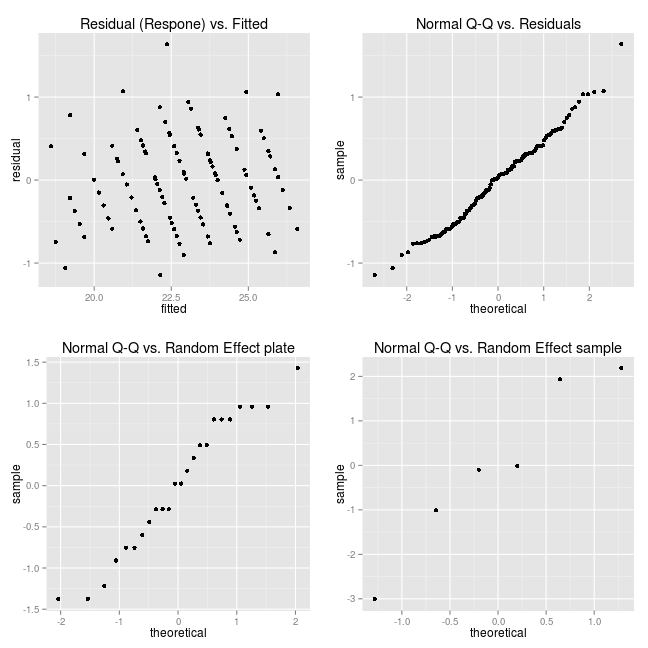
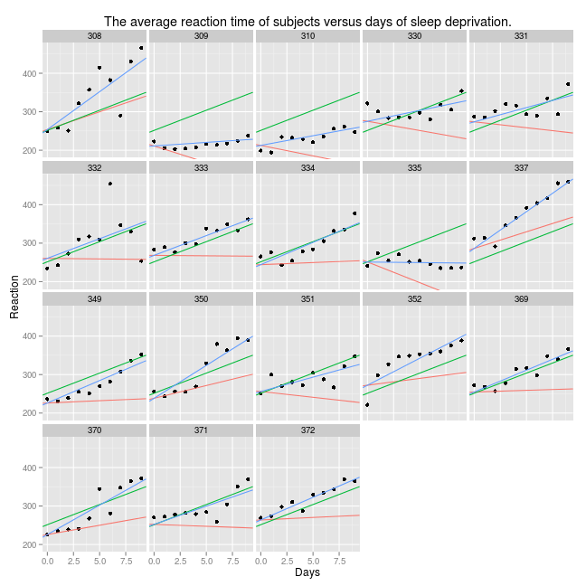
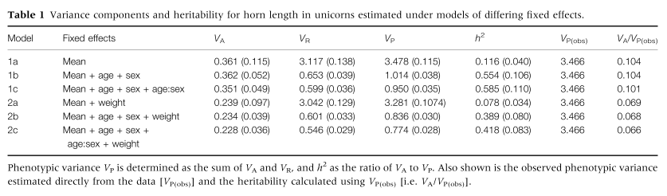

## About this presentation

<div class="build"><p>
In UGCD we are working on
</p></div>

>* Family-based sample (GAIT1 and GAIT2 projects)
>* Targeted to search for Quantitative Trait Loci (QTLs)
>* Heavily <s>abused</s> used  `SOLAR` tool

<div class="build"><p>
Objective of this presentation is to talk more about linear mixed models
</p></div>

>* write down some maths 
>* look at other examples rather than those polygenic ones
>* discuss the issues related to QTL analysis 

---

## About this presentation

<div class="build"><p>
Expected profit
</p></div>

>* be sure we use `SOLAR` in a proper way
>* be able to run its standard and, perhaps, advanced features 
>* and ... estimate the cost to go away from `SOLAR` one day <s>some contradiction has been detected here</s>

<div class="build"><p>
The way to make use of this presentation
</p></div>

>* Be aware of 'maths overload'
>* Focus on examples
>* Come back to the maths someday

---

## Agenda

* General linear models
* Mixed linear models
    * Examples
* Models in `SOLAR`    
* Discussion

--- 

## Timeline

>* Sir Ronald Fisher introduced random effect model to study the trait correlations between relatives in 1918.
>* Charles Roy Henderson derived best linear unbiased estimates (BLUE) for fixed effects 
  and best linear unbiased predictions (BLUP) for random effects in the 1950s.

<div class="build"><p>
It took some time to overcome the computation demands and make practical tools.
</p></div>

>* SOLAR: Sequential Oligogenic Linkage Analysis Routines (Blangero and Almasy, 1996).
>* A commercial program [ASReml](http://www.vsni.es/software/asreml) 
  by Gilmour and his colleges in 1999.
>* R package `nlme` since 1999 and [lme4](https://github.com/lme4/lme4/) since 2002 by Douglas Bates and his colleges.
>* R package [MCMCglmm](http://cran.r-project.org/web/packages/MCMCglmm/index.html):
  MCMC Generalised Linear Mixed Models (Hadfield, 2010).

Sources: [Wikipedia](http://en.wikipedia.org/wiki/Mixed_model), [github.com/lme4/BIRS](https://github.com/lme4/BIRS)

---

## Quick <s>and dirty</s> start from SOLAR

A model in which $n$ QTLs and polygenes influence a quantitative trait (Almasy and Blangero, 1998):

$$y_j = \mu + x_j \beta  + g_j + \sum_{i = 1}^{n}{q_{ij}} + e_j$$

* $y_j$: quantitative trait of the j-th individual
* $\mu$: the grand trait mean
* $x_j$: vector of covariates of the j-th individual
* $g_i$: additive polygenic effect of the j-th individual
* $q_{ij}$: the i-th QTL effect of the j-th individual
* $e_j$: random environmental deviation of the j-th individual

--- .segue .quote bg:indigo

## General Linear Models

---

## General Linear Model

$$y = X \beta + e$$

with

$$e \sim (0, \sigma_e^2 R)$$

* $y$: vector of $n$ observations
* $X$: the design or incidence $n \times p$ matrix
* $e$: vector of a residual error with covariance matrix $\sigma_e^2 R$,
    * off-diagonal elements of $R$ indicate the lack of independence,
      while the diagonal elements indicate the heteroscedasticity

<div class="build"><p>
Note that
</p></div>

>* $y$ and $X$ are observed data, while $\beta$ is a vector of parameters
>* $E(y) = X \beta$
>* $Var(y) = Var(e) = \sigma_e^2 R$

---

## Ordinary Least Squares (OLS)

The assumption is that the residual errors $e$ are uncorrelated and have equal variances (homoscedasticity).

* $\sigma^2(e_i) = \sigma_e^2$
* $\sigma(e_i, e_j) = 0$ for $i \neq j$

In a matrix form it has the form $e \sim (0, \sigma_e^2 I)$.

The OLS estimate of $\beta$ is a vector $b$ that minimizes the residual sum of squares 

$$\sum_{i = 1}^{n}{\hat{e}_i^2} = \hat{e}^T\hat{e} = (y - Xb)^T (y - Xb) \mbox{ } \rightarrow b = (X^TX)^{-1}X^T$$

<div class="build"><p>
Note that
</p></div>

>* If $e \sim MVN(0, \sigma_e^2 I)$, then the OLS estimate is also the maximum-likelihood estimate.
>* If $X^TX$ is singular, $b$ still hold when a generalized inverse is used.

---

## Gauss–Markov theorem

The OLS estimator is the best linear unbiased estimator (BLUE) of the coefficients $\beta$
for linear models in which the errors are uncorrelated and have equal variances.

>* best: it minimizes the sampling variance
>* linear: it is a linear function  of the observed data $y$
>* unbiased: $E(\hat{\beta}_{BLUE})) = \beta$

<div class="build"><p>
Note that the errors don't need to be normal, independent nor identically distributed
</p></div>

---

## Gauss–Markov theorem

The theorem was extended by Aitken to the general linear model in the case 
the errors have non-scalar covariance matrix. 

The BLUE in this case is

$$ \hat{\beta} = (X^TR^{-1}X)^{-1}X^TR^{-1}y $$

Derivation is hacked by multiplying both sides of the model equation by $R^{1/2}$.
See (Lynch and Walsh, 1998), Appendix 3, pp. 842.

---

## Summary on General Linear Models

>* Modeling a quantitative trait assumes working in terms of both <b>mean</b> and <b>variance</b>.
>* The best linear unbiased estimator (BLUE) provides estimation of the model parameters (coefficients $\beta$).

--- .segue .quote bg:DarkViolet

## Linear Mixed Models

---

## Mixed Model (in Genetics)

$$ y = X\beta + Zu + e$$

>* Consider a vector $y$ of the phenotype measured in $n$ individuals.
>* We assume that these observations are described adequately by a linear model with
    * $p \times 1$ vector of fixed effects ($\beta$) 
    * and $q \times 1$ vector of random effects ($u$).
>* The first element of the vector $\beta$ is typically the population mean.
>* Other elements of the vector $\beta$ may be gender, location, year of birth, experimental treatment, etc.
>* The elements of the vector $u$ are usually genetic effects such as additive genetic values.

See (Lynch and Walsh, 1998), Chapter 26, pp. 746.
Example 1 on page 746 is a <i>must</i> (this comes in a few slides).

---

## Mixed Model (matrix form)

$$ y = X\beta + Zu + e$$

* $X$: $n \times p$ incidence or design matrix
* $Z$: $n \times q$ incidence matrix
* $e$: $n \times 1$ vector of residual deviations

<div class="build"><p>
Note that
</p></div>

>* $e$ assumed to be distributed independently of the random genetic effects (thus, we can sum up variances).
>* Usually, all elements of $Z$ matrix are either `0` or `1`.

---

## Example 1 

Suppose that three sires are chosen at random from a population,
and each mated to a randomly chosen dam.
Two offspring from each mating are evaluated, some in environment 1 and some in environment 2.
The models assumes no sire $\times$ environment interaction.

Let $y_{ijk}$ denote the phenotypic value of the $k$th offspring of sire i in environment j.
The model is then

$$ y_{ijk} = \beta_j + u_i + e_{ijk} $$

The model has three random effects, which measure the contribution from each sire.

$$u = \left\lgroup
  \matrix{u_1 \cr u_2 \cr u_3}
\right\rgroup
$$

The model also has two fixed effect, which describe the influence of the two environments.

$$u = \left\lgroup
  \matrix{\beta_1 \cr \beta_2}
\right\rgroup
$$

---

## Example 1 with simulated data

$$ y = X\beta + Zu + e$$

$$y = \left\lgroup
  \matrix{y_{1,1,1} \cr y_{1,2,1} \cr y_{2,1,1} \cr y_{2,1,2} \cr y_{3,1,1} \cr y_{3,2,1}} 
\right\rgroup
  =
\left\lgroup  
  \matrix{9 \cr 12 \cr 11 \cr 6 \cr 7 \cr 14}  
\right\rgroup  
$$

$$X = \left\lgroup
  \matrix{1 & 0 \cr 0 & 1 \cr 1 & 0  \cr 1 & 0 \cr 1 & 0 \cr 0 & 1} 
\right\rgroup
\mbox{, }
Z = \left\lgroup
  \matrix{1 & 0 & 0 \cr 1 & 0 & 0 \cr 0 & 1 & 0 \cr 0 & 1 & 0 \cr 0 & 0 & 1 \cr 0 & 0 & 1} 
\right\rgroup
$$

---

## Mixed Model vs. General Linear model

General linear model

$$ y = X\beta + e^* \mbox{ where } \mbox{ } \mbox{ } e^* \sim (0, V) \mbox{ implying } \mbox{ } \mbox{ } y \sim (X\beta, V)$$

Mixed model partitions the residual effect into two components, with $e^* = Zu + e$, giving

$$ y = X\beta + Zu + e \mbox{ where } \mbox{ } \mbox{ } u \sim (0, G) \mbox{ and } \mbox{ } \mbox{ } e \sim (0, R)$$ 

$$ \mbox{ implying } \mbox{ } \mbox{ } y \sim (X\beta, V) = (X\beta, ZGZ^T + R)$$

<div class="build"><p>
Note that
</p></div>

>* Both formulations yield the same estimate of the fixed effects $\beta$, when analyzed in the appropriate way.
>* The mixed-model formulation further allows estimates of the random effects $u$.

---

## BLUE and BLUP

BLUE of $\beta$ is just the generalized least-squares estimator

$$ \hat{\beta} = (X^TV^{-1}X)^{-1}X^TV^{-1}y $$

Henderson showed that the BLUP of $u$ is

$$ \hat{u} = (GZ^TV^{-1})(y - X\hat{\beta}) $$

---

## Summary on Mixed Models

>* $y$, $X$, $Z$ are observed
>* $\beta$, $u$, $R$, $G$ are unknown
>* The covariance matrices $R$ and $G$ typically are functions of a few unknown parameters ($\sigma$-parameters)
>* Analysis involves two complementary tasks:
    1. estimation of the covariance matrices $G$ and $R$
    2. estimation of the fixed and random effects, $\beta$ and $u$ (BLUE and BLUP)

<div class="build"><p>
Maximum likelihood (ML) and Restricted Maximum likelihood (REML) are the methods for variance-component estimation.
It could be the topic of another presentation. <s>This presentation has been already saturated with maths</s>.
See (Lynch and Walsh, 1998), Chapter 27.
</p></div>

---

## Example 1 to be finished

What are the BLUP values for the sire effects $(u_1, u_2, u_3)$?

<div class="build"><p>
Some assumptions are needed:
</p></div>

>* We assume that the residual variances within both environments are the same ($\sigma_e^2$),
  so $R = \sigma_e^2 I$, where $I$ is the $6 \times 6$ identity matrix.
>* We assume that all three sires are unrelated and drawn from the same population,
  $G = \sigma_s^2I$, where $I$ is the $3 \times 3$ identity matrix.

<div class="build"><p>
Imagine the the step 1 (see the previous slide) is completed,
and we know $\sigma_e^2 = 6$ and $\sigma_s^2 = 2$.
Thus, the covariance matrix $V$ is given by $ZGZ^T + R$.
</p></div>

<div class="build"><p>
$$V = 2 \left\lgroup
  \matrix{1 & 0 & 0 \cr 1 & 0 & 0 \cr 0 & 1 & 0 \cr 0 & 1 & 0 \cr 0 & 0 & 1 \cr 0 & 0 & 1} 
\right\rgroup
I_{3 \times 3}
\left\lgroup
  \matrix{1 & 1 & 0 & 0 & 0 & 0 \cr 0 & 0 & 1 & 1 & 0 & 0 \cr 0 & 0 & 0 & 0 & 1 & 1}  
\right\rgroup
\mbox{ + } 6 I_{6 \times 6}
$$
</p></div>

---

## Example 1 last shot

$$V = \left\lgroup
  \matrix{8 & 2 & 0 & 0 & 0 & 0 \cr 2 & 8 & 0 & 0 & 0 & 0 \cr 0 & 0 & 8 & 2 & 0 & 0 \cr
    0 & 0 & 2 & 8 & 0 & 0 \cr 0 & 0 & 0 & 0 & 8 & 2 \cr 0 & 0 & 0 & 0 & 2 & 8} 
\right\rgroup
$$

<div class="build"><p>
A few simple matrix calculations are left.
</p></div>

<div class="build"><p>
$$\hat{\beta} = 
  \left\lgroup
    \matrix{\hat{\beta}_1 \cr \hat{\beta}_2}  
  \right\rgroup
  = (X^TV^{-1}X)^{-1}X^TV^{-1}y =
  \frac{1}{18} 
  \left\lgroup
    \matrix{148 \cr 235} 
  \right\rgroup
$$
</p></div>

<div class="build"><p>
$$ \hat{u} = 
 \left\lgroup
    \matrix{\hat{u}_1 \cr \hat{u}_2 \cr \hat{u}_3}  
  \right\rgroup
  = (GZ^TV^{-1})(y - X\hat{\beta}) = 
  \frac{1}{18} 
  \left\lgroup
    \matrix{-1 \cr 2 \cr -1} 
  \right\rgroup
$$
</p></div>

<div class="build"><p>
Now try to compare the effects knowing that

$$y = (9, 12, 11, 6, 7, 14) $$
</p></div>

--- .segue .quote bg:magenta

## Examples

--- 

## Genetics Mixed Models and others

<div class="build"><p>
Mixed Model for GAIT1 sample (398 individuals in 21 families)
</p></div>

>* `398` random effects (length of the vector $u$)
>* `Z` incidence matrix is the identity matrix $I_{398 \times 398}$
>* the random effects are distributed as $(0, A_{398 \times 398})$,
  where $A$ is 2$\times$ kinship matrix

<div class="build"><p>
General-case examples are rather different from those in the genetics.
</p></div>

>* random effects are applied to both intercepts and slopes
>* covariance matrix of the random effect is the identity matrix

--- 

## Example 2: Penicillin data

```
Description:

     Six samples of penicillin were tested using the _B.  subtilis_
     plate method on each of 24 plates.  The response is the diameter
     (mm) of the zone of inhibition of growth of the organism.

Format:

     A data frame with 144 observations on the following 3 variables.

     ‘diameter’ diameter (mm) of the zone of inhibition of the growth
          of the organism.

     ‘plate’ assay plate.  A factor with levels ‘a’ to ‘x’.

     ‘sample’ penicillin sample.  A factor with levels ‘A’ to ‘F’.
```

--- 

## Penicillin data


--- 

```r
library(lme4)
data(Penicillin)
lmer(diameter ~ (1|plate) + (1|sample), Penicillin)
```

```
 Linear mixed model fit by REML ['lmerMod']
 Formula: diameter ~ (1 | plate) + (1 | sample) 
    Data: Penicillin 
 
 REML criterion at convergence: 330.9 
 
 Random effects:
  Groups   Name        Variance Std.Dev.
  plate    (Intercept) 0.717    0.847   
  sample   (Intercept) 3.731    1.932   
  Residual             0.302    0.550   
 Number of obs: 144, groups: plate, 24; sample, 6
 
 Fixed effects:
             Estimate Std. Error t value
 (Intercept)   22.972      0.809    28.4
```

---

## Penicillin model diagnostics



--- 

## Example 3: sleepstudy data

```
Description:

     The average reaction time per day for subjects in a sleep
     deprivation study. On day 0 the subjects had their normal amount
     of sleep.  Starting that night they were restricted to 3 hours of
     sleep per night.  The observations represent the average reaction
     time on a series of tests given each day to each subject.

Format:

     A data frame with 180 observations on the following 3 variables.

     ‘Reaction’ Average reaction time (ms)

     ‘Days’ Number of days of sleep deprivation

     ‘Subject’ Subject number on which the observation was made.
```

---

```r
lmer(Reaction ~ Days + (Days|Subject), sleepstudy)
```

```
 Linear mixed model fit by REML ['lmerMod']
 Formula: Reaction ~ Days + (Days | Subject) 
    Data: sleepstudy 
 
 REML criterion at convergence: 1744 
 
 Random effects:
  Groups   Name        Variance Std.Dev. Corr
  Subject  (Intercept) 612.1    24.74        
           Days         35.1     5.92    0.07
  Residual             654.9    25.59        
 Number of obs: 180, groups: Subject, 18
 
 Fixed effects:
             Estimate Std. Error t value
 (Intercept)   251.41       6.82    36.8
 Days           10.47       1.55     6.8
 
 Correlation of Fixed Effects:
      (Intr)
 Days -0.138
```

--- 

## Random and Fixed Effects

<font color='blue'>total</font> effect = <font color='green'>fixed</font> effect +
  <font color='red'>random</font> effect



---

## Comparison of Models

```r
m2 <- lmer(Reaction ~ Days + (Days|Subject), sleepstudy)
m2.uncorr <- lmer(Reaction ~ Days + (1|Subject) + (0+Days|Subject), sleepstudy)
anova(m2, m2.uncorr)
```

```
Data: sleepstudy
Models:
m2.uncorr: Reaction ~ Days + (1 | Subject) + (0 + Days | Subject)
m2: Reaction ~ Days + (Days | Subject)
          Df    AIC    BIC  logLik deviance  Chisq Chi Df Pr(>Chisq)
m2.uncorr  5 1762.0 1778.0 -876.00   1752.0                         
m2         6 1763.9 1783.1 -875.97   1751.9 0.0639      1     0.8004
```

---

## Summary on Examples

>* The definition of a random effect can be implemented either via `Z` matrix or `G` matrix.
>* Currently, the `lme4  ` package allows only the `Z`-based parametrization.
>* Rönnegård and Carlborg have shown a statistically equivalent definition of `G` matrix
  via an incidence matrix `Z` (Ronnegard and Carlborg, 2007). 
  See also [hglm](http://cran.r-project.org/web/packages/hglm/index.html) R package.


--- .segue .quote bg:maroon

## SOLAR Models

---

## Polygenic (Univariate) Model

$$ y = X\beta + g + Hc + e$$

$$\mbox{ where } \mbox{ } \mbox{ } g \sim (0, \sigma_g^2 A) 
  \mbox{ and } \mbox{ } \mbox{ } c \sim (0, \sigma_c^2 I)
  \mbox{ and } \mbox{ } \mbox{ } e \sim (0, \sigma_e^2 I)$$ 
  
$$ \mbox{ implying } \mbox{ } \mbox{ } y \sim (X\beta, V) = (X\beta, \sigma_g^2 A + \sigma_c^2 I + \sigma_e^2 I)$$


Heritability: $h = \frac{\sigma_g^2}{\sigma_g^2 + \sigma_c^2 + \sigma_e^2}$.

Likelihood Ratio Test (LRT):

Model | Free Parameters | Restricted Parameters
--- | --- | ---
No polygenic effect | $\sigma_c^2$, $\sigma_e^2$ | $\sigma_g^2$ = 0 

---

## Bivariate (correlation) Model

$$\begin{pmatrix}
  y_1 \\
  y_2
\end{pmatrix}_{nk \times 1} =
\begin{pmatrix}
  X_1 & 0 \\
  0 & X_2
\end{pmatrix}_{nk \times nk}
\begin{pmatrix}
  \beta_1 \\
  \beta_2
\end{pmatrix}_{nk \times 1}
+
\begin{pmatrix}
  g_1 \\
  g_2
\end{pmatrix}_{nk \times 1}
+
\begin{pmatrix}
  e_1 \\
  e_2
\end{pmatrix}_{nk \times 1}
$$

$$G_{nk \times nk} = C_{k \times k} \otimes A_{n \times n} =
\begin{pmatrix}
  c_{11} A & c_{12} A \\
  c_{21} A & c_{21} A
\end{pmatrix} =
\begin{pmatrix}
  \sigma_{1}^2 A & \rho \sigma_{1} \sigma_{2} A \\
  \rho \sigma_{1} \sigma_{2} A & \sigma_{2}^2 A
\end{pmatrix}_{g}
$$

$$R_{nk \times nk} = E_{k \times k} \otimes I_{n \times n} =
\begin{pmatrix}
  e_{11} I & e_{12} I \\
  e_{21} I & e_{21} I
\end{pmatrix} =
\begin{pmatrix}
  \sigma_{1}^2 I & \rho \sigma_{1} \sigma_{2} I \\
  \rho \sigma_{1} \sigma_{2} I & \sigma_{2}^2 I
\end{pmatrix}_{e}
$$

Likelihood Ratio Test (LRT):

Model | Free Parameters | Restricted Parameters
--- | --- | ---
No genetic correlation | $(\sigma_1^2, \sigma_2^2)_g$, $(\sigma_1^2, \sigma_2^2, \rho)_e$ | $\rho_g = 0$
No pleiotropy  | $(\sigma_1^2, \sigma_2^2)_g$, $(\sigma_1^2, \sigma_2^2, \rho)_e$ | $\rho_g = 1$
No environmental correlation | $(\sigma_1^2, \sigma_2^2, \rho)_g$, $(\sigma_1^2, \sigma_2^2)_e$ | $\rho_e = 0$

--- 

## Weight is a covariate for model of Height



(Wilson, 2008)

>Comparing models 2a–c with models 1a–c shows that including weight yields lower estimates of $V_A$, with concomitant declines in the >heritability. This is because the structure of the `G` matrix used to simulate the phenotypes was such that a positive genetic >correlation exists between weight and horn length. Thus, accounting for differences among individuals in the weight actually removes a >portion of additive variance for the horn length. Thus, the estimates of $V_A$ (and heritability) under models 2a–c are
>conditioned on the second trait of weight.

---

## Linkage (Univariate) Model

$$ y = X\beta + g + Hc + q + e$$

$$\mbox{ where } \mbox{ } \mbox{ } g \sim (0, \sigma_g^2 A) 
  \mbox{ and } \mbox{ } \mbox{ } c \sim (0, \sigma_c^2 I)
  \mbox{ and } \mbox{ } \mbox{ } p \sim (0, \sigma_q^2 IBD)  
  \mbox{ and } \mbox{ } \mbox{ } e \sim (0, \sigma_e^2 I)$$ 
  
$$ \mbox{ implying } \mbox{ } \mbox{ } y \sim (X\beta, V) = (X\beta, \sigma_g^2 A + \sigma_c^2 I + \sigma_q^2 IBD + \sigma_e^2)$$

Likelihood Ratio Test (LRT):

Model | Free Parameters | Restricted Parameters
--- | --- | ---
No linkage | $\sigma_g^2, \sigma_c^2$, $\sigma_e^2$ | $\sigma_q^2$ = 0 


---

## Assosiation Model

$$ y = X\beta + \beta_{SNP} * SNP + g + Hc + e$$

$$\mbox{ where } \mbox{ } \mbox{ } g \sim (0, \sigma_g^2 A) 
  \mbox{ and } \mbox{ } \mbox{ } c \sim (0, \sigma_c^2 I)
  \mbox{ and } \mbox{ } \mbox{ } e \sim (0, \sigma_e^2 I)$$ 
  
$$ \mbox{ implying } \mbox{ } \mbox{ } y \sim (X\beta, V) = (X\beta, \sigma_g^2 A + \sigma_c^2 I + \sigma_e^2 I)$$


Likelihood Ratio Test (LRT):

Model | Free Parameters | Restricted Parameters
--- | --- | ---
No association | $\sigma_g^2, \sigma_c^2$, $\sigma_e^2$ | $\beta_{SNP} = 0$ 

---

## Summary on SOLAR Models

<div class="build"><p>
What SOLAR topics should have also been here?
</p></div>

>* Bivariate Linkage Model
>* Sex-Specific Model
>* Parent-Of-Origin Model (available in SOLAR?)
>* Derivation and testing the phenotypic correlation
>* Definition of the LOD score and its correction methods

--- .segue .quote bg:crimson

## Discussion

---

## My long way of learning things

>1. Manual of `SOLAR`
>2. Papers of `SOLAR`
>3. Tutorials on the animal model
>4. <b>Book (Lynch and Walsh, 1998)</b>, Chapters 26 and 27
>5. Writing my own code [github.com/variani/solaris](https://github.com/variani/solaris)
>6. Watching project of other people and trying to contribute to [github.com/variani/lme4](https://github.com/variani/lme4)

---

## Next Candidate Topics

>* Mixed models in application to other type of genetic data?
  Our data are family-based GAIT!
>* Multivariate variance-based methods to fix the family effect?
>* Review pro y contra family-based clinical studies
>* Improve polygenic model by adding diet and/or treatment as random variable

--- .segue .quote bg:indigo

## Are we ready for GAIT2?

---

## Are we ready for GAIT2?

Workflow 'Linkage > Fine-Mapping > Gene Candidates'

>* Linkage maps based on SNPs and further linkage analysis
>* Use of gene expression data to confirm a gene-candidate
>* Association with haplotypes
>* Simultaneous linkage and association (rare variants?)
>* Multi-loci association 
>* Association with imputed SNPS

---

## Are we ready for GAIT2?

Storage and sharing knowledge at [github.com/ugcd](https://github.com/ugcd)

>* Do some planning about methods/tools we are going to use
>* Work hard to deliver the phenotypic information about GAIT2
>* Invite partners to contribute (UPC, Genebra, etc) and share their ideas
>* Store the material of publications by the group

---

## References

[1] L. Almasy and J. Blangero. "Multipoint quantitative-trait
linkage analysis in general pedigrees.". In: _American journal of
human genetics_ 62.5 (May. 1998), pp. 1198-211. ISSN: 0002-9297.
DOI: 10.1086/301844. <URL:
http://www.pubmedcentral.nih.gov/articlerender.fcgi?artid=1377101\&tool=pmcentrez\&rendertype=abstract>.

[2] J. Blangero and L. Almasy. "Solar: sequential oligogenic
linkage analysis routines". In: _Population Genetics Laboratory
Technical Report_ 6 (1996).

[3] J. D. Hadfield. "MCMCglmm: MCMC Methods for Multi-Response
GLMMs in R". In: _Journal of Statistical Software_ 33.2 (2010).

[4] M. Lynch and B. Walsh. _Genetics and Analysis of Quantitative
Traits_. Sinauer, 1998. <URL:
http://www.invemar.org.co/redcostera1/invemar/docs/RinconLiterario/2011/febrero/AG\_8.pdf>.

[5] L. Ronnegard and O. Carlborg. "Separation of base allele and
sampling term effects gives new insights in variance component QTL
analysis.". In: _BMC genetics_ 8 (Jan. 2007), p. 1. ISSN:
1471-2156. DOI: 10.1186/1471-2156-8-1. <URL:
http://www.pubmedcentral.nih.gov/articlerender.fcgi?artid=1781068\&tool=pmcentrez\&rendertype=abstract>.

[6] A. J. Wilson. "Why h2 does not always equal V A/V P?". In:
_Journal of evolutionary biology_ 21.3 (May. 2008), pp. 647-50.
ISSN: 1420-9101. DOI: 10.1111/j.1420-9101.2008.01500.x. <URL:
http://www.ncbi.nlm.nih.gov/pubmed/18266683>.


---

## Credits

* [slidify](http://slidify.org/), [io2012](http://slidify.org/samples/intro/)
* [knitr](http://yihui.name/knitr/) 
* [knitcitations](http://carlboettiger.info/2012/05/30/knitcitations.html)

--- .thank-you-slide .segue .nobackground

## Thank you
