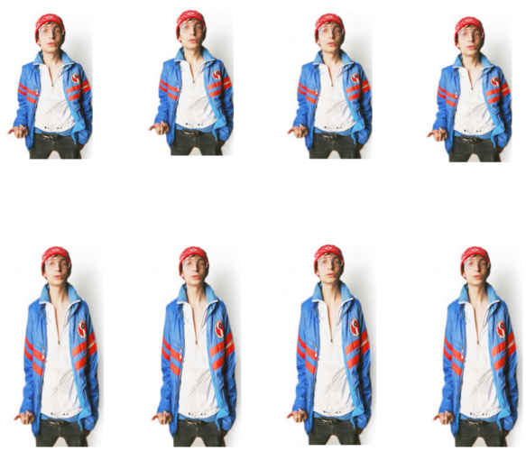
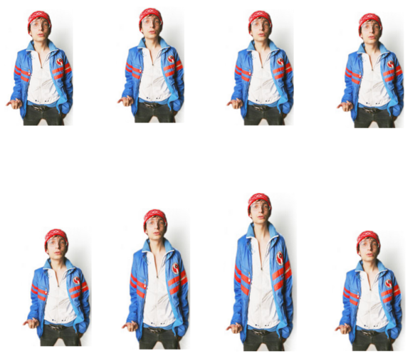
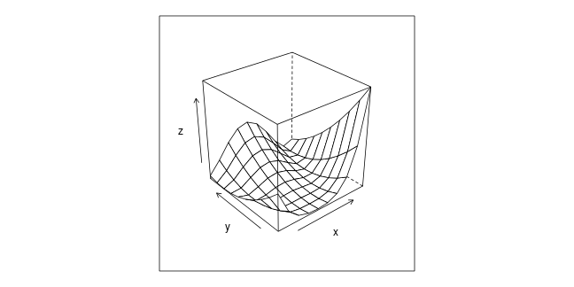

## About this presentation

A number of things happened since February 2014:

>* Updated the code in `salamboR`.
>* Re-computed the models for 2 studies (on-going publications).
>* Initiated the data repositories on [github.com/ugcd/](https://github.com/ugcd/)

In this presentation we would like to share with you:

>* the achieved results
>* <b>our</b> rules on computing' and interpreting'em all 
>* focus on details when interpreting the models

---

## Table of content

* Results (to be published)
    * Platelets traits
    * TEG traits
* Decision making
    * Modeling background
    * Changes in code
    * Rules
* Summary

--- .segue .quote bg:#99CC99

## Results

---

## Models for thrombosis

Disease | N | h2r | h2r.se | h2r.P | AGE | AGE.se | AGE.P
--- | --- | --- | --- | --- | --- | --- | --- | --- 
AT | 1113 | 0.234 | 0.194 | 1.409e-01 | -0.0352 | 0.0051 | 9.8881e-18
VT | 1113 | 0.669 | 0.165 |	1.600e-06 | -0.0234 | 0.0038 | 6.2843e-12
Throm | 1113 | 0.456 | 0.134 | 9.430e-05 | -0.0329 | 0.0036 |	5.4151e-27

 

Comments

* the heretability of `AT` is not significant.

---

## Work 1: Platelets traits

trait1 | trait 2|	rhoG|	rhoG.se|	rhoG.P|	rhoE	|rhoE.se	| rhoE.P
--- | --- | --- | --- | --- | --- | --- | --- 
BA|VT	|-0.104	|0.158|	0.511|	0.367|	0.238|	0.169
EO|VT|	-0.237	|0.151|	0.133|	-0.436|	0.225|	0.045
LE|VT|	0.030|	0.194|	0.876|	0.225|	0.268|	0.361
LI|VT|	0.117|	0.160|	0.472|	0.073|	0.277|	0.786
MOt|VT|	0.178|	0.185|	0.365|	0.236|	0.209|	0.285
NE|VT	|||||||

 

Comments

* None of the genetic correlations are significant.
* Correlation between `NT` and `VT` is not computable.

---

## Work 2: TEG traits

trait1 | trait 2|	rhoG|	rhoG.se|	rhoG.P|	rhoE	|rhoE.se	| rhoE.P
--- | --- | --- | --- | --- | --- | --- | --- 
VT| 	TGTlagtime 	|	0.125| 	0.140| 	3.784e-01|	0.186| 	0.235| 	4.515e-01
VT| 	TGTPeak | 0.356| 	0.136| 	1.079e-02|  	0.257| 	0.234| 	2.907e-01
VT| 	TGTETP | 0.314| 	0.121| 	2.079e-02  	|0.323| 	0.211| 	1.406e-01

 

Comments

* Two genetic correlations with `TGTPeak` and `TGTETP`, which of them does make more sense?

--- 

## Work 2: TEG traits

trait1 | trait2 | rhoG | rhoG.se | rhoG.P
--- | --- | --- | --- | --- 
VT | TGTETP | -0.25 | 0.32 | 
VT | TGTPeak | 0.42 | 0.044 | 
TGTPeak | TGTETP | 0.729 | 0.062 | 

 

Idea

* The genes affecting all traits `VT`, `TGTPeak` and `TGTETP` are considered <b>simultaneously</b>.

--- .segue .quote bg:#CCCC00

## Decision making

---

## Questions we had at the beginning

>* What is `N` of the GAIT2 study?
>* What disease to model in correlation with a trait: `VT`, `AT` or `Throm`?
>* How to use covariates like `antiAgreg`?
>* If $\rho_p$ is not significant, should I panic?
>* If $\rho_g$ is estimated as $0.9 \pm 0.001$ with p-value $1.2 \times 10^{-8}$, 
  should I make the boss happy by reporting this?

--- .segue .quote bg:#0F3B5F

## Modeling background

--- 

## Model and its parameters

Think of a statistical model in terms of its parameters.

 

Univariate Model:

Fixed Effects Parameters | Random Effects Parameters
--- | ---
$\mu, \beta_{AGE}, \beta_{SEX}$  | $\sigma_g^2, \sigma_e^2$

--- 

## A fixed effect controlling the mean of height

Idea: [http://users.du.se/~lrn/DUweb/](http://users.du.se/~lrn/DUweb/)

---

## A random effect controlling the variance of height

Image source: [http://ludwig.design.ru/](http://ludwig.design.ru/)

--- 

## Tests of model parameters

Fixed Effects Parameters | Random Effects Parameters
--- | ---
$\mu, \beta_{AGE}, \beta_{SEX}$  | $\sigma_g^2, \sigma_e^2$

Heritability: $h^2 = \frac{\sigma_g^2}{\sigma_g^2 + \sigma_e^2}$.

 

Is the heritability significant? Likelihood Ratio Test (LRT):

Hypothesis | Free Parameters | Restricted Parameters
--- | --- | ---
No polygenic effect | $\mu, \beta_{AGE}, \beta_{SEX}, \sigma_e^2$ | $\sigma_g^2$ = 0 

 

Is `AGE` covariate significant? Likelihood Ratio Test (LRT):

Hypothesis | Free Parameters | Restricted Parameters
--- | --- | ---
No effect of `AGE` | $\mu, \beta_{SEX}, \sigma_g^2, \sigma_e^2$ | $\beta_{AGE} = 0$

---

## Bivariate Model for correlations

Univariate Model

Fixed Effects Parameters | Random Effects Parameters
--- | ---
$\mu, \beta_{AGE}, \beta_{SEX}$  | $\sigma_g^2, \sigma_e^2$

 

Bivariate Model

Fixed Effects Parameters | Random Effects Parameters
--- | ---
$\mu_1, \mu_2, (\beta_1, \beta_2)_{AGE}, (\beta_2)_{SEX}$ | $(\sigma_1^2, \sigma_2^2, \rho)_g, (\sigma_1^2, \sigma_2^2, \rho)_e$

 

Is the genetic correlation significant? Likelihood Ratio Test (LRT):

Hypothesis | Free Parameters | Restricted Parameters
--- | --- | ---
No genetic correlation | $\ldots, (\sigma_1^2, \sigma_2^2)_g$, $(\sigma_1^2, \sigma_2^2, \rho)_e$ | $\rho_g = 0$
No pleiotropy  | $\ldots, (\sigma_1^2, \sigma_2^2)_g$, $(\sigma_1^2, \sigma_2^2, \rho)_e$ | $\rho_g = 1$

--- .segue .quote bg:#FFCC00

## Changes in code

---

## Changes in code

Fixes

1) Trait-specific covariates in bivariate models

Example: bivariate model of `VT` and `TGTETP`

* Independent univariate models

Trait | Covariates
--- | ---
VT | AGE
TGTETP | AGE, AGE^2, contraception, sedentaryD 

* A bivariate model before February 2014 

Trait | Covariates
--- | ---
VT | AGE, AGE^2, contraception, sedentaryD 
TGTETP | AGE, AGE^2, contraception, sedentaryD 

---

## Changes in code

Fixes

2) P-values of all test covariates vs. final covariates (in reports)

Example: univariate model of `VT`.

* Testing model with `6` covariates

AGE | AGE.P | SEX.P | CONTRA.P |	AINEs.P | antiAgreg.P | SMOKE.P
--- | --- | --- | --- | --- | --- | --- 
-0.02 | 5.15e-10 | 1.36e-01 | 1.68e-01 | 7.85e-01 |	9.26e-01 | 8.92e-01 	

* Final model with `1` covariates

AGE | AGE.P
--- | --- 
-0.02 | 6.2843e-12

---

## Changes in code

New options

1. `Compute hard` options (see `solarPolyg` function).
2. Computing the phenotypic correlation can be skipped.
3. Trivariate models are available.

--- .segue .quote bg:#C9341C

## Rules

--- 

## Rule: think twice when adding a covariate

Example: `antiAgreg` covariate in a model for `AT`

---

## Rule: Filter out suspicious results

Problem: 

* If the optimization algorithm does not converge, 
    then the returned model is not OK.
* Consequently, SOLAR warnings and extreme estimations like $\rho_g = 1$.
* See `optim` R function and an example with [Rosenbrock Banana function](http://en.wikipedia.org/wiki/Rosenbrock_function).  
   * $z = f(x, y)$ has the global minimum at `(1, 1)` point, where the function is equal to `0`.

---

## Rule: Filter out suspicious results

Example: bivariate correlation `NE` and `VT` (not OK)

trait1 | trait 2|	rhoG|	rhoG.se|	rhoG.P|	rhoE	|rhoE.se	| rhoE.P
--- | --- | --- | --- | --- | --- | --- | --- 
NE|VT|0.6748| 	NA	|7.9140e-04| 	1.0000e+00 |	0.8246|NA| 		1.0056e-13

 

What is wrong?

* Estimation of standard errors are `NA`.
* Estimation of $\rho_e$ is `1`.

---

## Rule: Filter out suspicious results

Example: bivariate correlation `EO` and `VT` executed with `compute hard` options (not OK)

trait1 | trait 2|	rhoG|	rhoG.se|	rhoG.P|	rhoE	|rhoE.se	| rhoE.P
--- | --- | --- | --- | --- | --- | --- | --- 
EO|VT|-0.7623| 	0.0977	|1.3693e-11| 	-0.9000 |	0.0723| 7.6188e-18

 

What is wrong?

* Estimation of $\rho_e$ is `-0.9` (it is on the boundary).
  * Estimations of standard errors are suspiciously small.
  * P-values are suspiciously small.

---

## Rule: `Throm` is preferred to `VT`

Problem

* Small `N` &#8594; instability, low statistical power

Solution

* Try correlation with `VT`
* Change the order of traits to test the consistence of the results
* Confirm results by comparing with correlation with `Throm`

--- 

## Rule: `Throm` is preferred to `VT`

Example: trivariate correlation `VT`, `TGTPeak` and `TGTETP`

* Order `VT`, `TGTlagtime`, `TGTETP`

Not computable.

* Order `VT`, `TGTPeak`, `TGTETP` (not OK)

trait1 | trait2 | rhoG | rhoG.se 
--- | --- | --- | --- 
VT | TGTETP | 0.008 | 0.005 
VT | TGTPeak | 0.506| 0.004 
TGTPeak | TGTETP | 0.796 | NA 

--- 

## Rule: `Throm` is preferred to `VT`

Example: trivariate correlation `VT`, `TGTPeak` and `TGTETP`

* Order `VT`, `TGTETP`, `TGTPeak` (OK)

trait1 | trait2 | rhoG | rhoG.se
--- | --- | --- | ---  
VT | TGTETP | -0.25 | 0.32  
VT | TGTPeak | 0.42 | 0.044
TGTPeak | TGTETP | 0.729 | 0.062 

* Model with `Throm`, order `Throm`, `TGTPeak`, `TGTETP` (OK?)

trait1 | trait2 | rhoG | rhoG.se
--- | --- | --- | ---  
Throm | TGTETP | -0.117 | 0.007  
Throm | TGTPeak | 0.438 | 0.006
TGTPeak | TGTETP | 0.755 | 0.007 

---

## Rule: only $\rho_g$ matters

Explanation:

* The genetic correlation $\rho_g$ has a co-variance matrix <b>structured</b> (kinship),
  while the residual environmental $\rho_e$ has the identity matrix (i.i.d.)
* Indeed, the environmental correlation $\rho_e$ is a part of not explained residual (error).  
* Phenotipic correlation $\rho_p$
    * is not a model parameter
    * it has a large error
    * it computationally complicated to test (remember its formula)

---

## Rule: only $\rho_g$ matters

Why $\rho_e$ and $\rho_p$ are out?

* Have you ever tried to response to such a Reviewer's comment of a submitted manuscript?

Page 9, lines 36-38. It is stated that there is no environmental correlation between BMI and thrombosis risk. This is in contrary to conventional perception about these two phenotypes. For example, diet is a risk factor for both obesity and thrombosis, especially arterial thrombosis. Other risk factors, such as physical inactivity, could also influence both phenotypes.

---

## Rule: only $\rho_g$ matters

Example: bivariate correlation between `EO` and `VT`

trait1 | trait 2|	rhoG|	rhoG.se|	rhoG.P|	rhoE	|rhoE.se	| rhoE.P
--- | --- | --- | --- | --- | --- | --- | --- 
EO|VT|	-0.237	|0.151|	0.133|	-0.436|	0.225|	0.045

 

Comments:

* The environmental correlation $\rho_e$ is significant, but the genetic correlation $\rho_g$ is not.
    * That means the model must be recomputed with restriction $\rho_g = 0$,
      that will give the correct estimation of $\rho_e$.

---

## Alessandra's Rule: p-value 1e-22

Example: bivariate correlation between `EO` and `VT`

* The current results

trait1 | trait 2|	rhoG|	rhoG.P|	rhoE	| rhoE.P
--- | --- | --- | --- | --- | --- | 
EO|VT|	-0.237	|	0.133|	-0.436|	0.045

* Computed before Feb 2014

trait1 | trait 2|	rhoG|	rhoG.P|	rhoE	| rhoE.P
--- | --- | --- | --- | --- | --- 
EO|VT|	-0.81	|6.2e-12|	-0.9|	3.6e-22

What was wrong?

* All the issues commented above
  * `bmi` as covariate
  * covariates not trait-specific
* <s>Bad luck</s> Lack of our rules for interpretation the results

--- .segue .quote bg:#B76EB8

## Summary

---

## Our experience (our feeling)

<s>All models are wrong, but some are useful.</s>

Most of correlations are insignificant, but some are ... incomputable.

---

## Our proposal

Work hard / Keep learning / Share <b>all</b> at [https://github.com/ugcd/](https://github.com/ugcd/)

---

## Credits

* [slidify](http://slidify.org/), [io2012](http://slidify.org/samples/intro/)
* [knitr](http://yihui.name/knitr/) 
* [knitcitations](http://carlboettiger.info/2012/05/30/knitcitations.html)

--- .thank-you-slide .segue .nobackground

## Thank you

