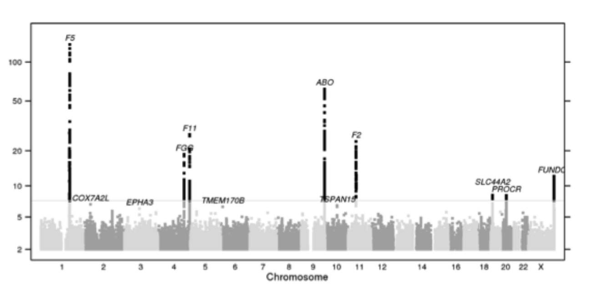
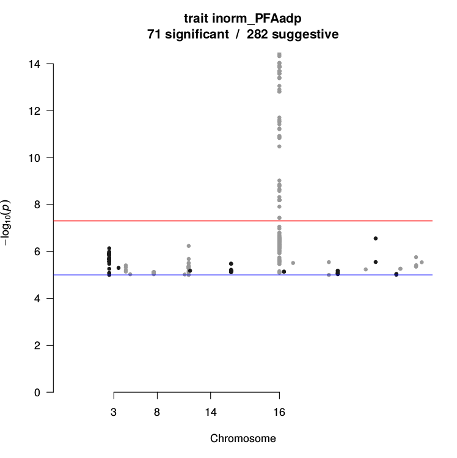
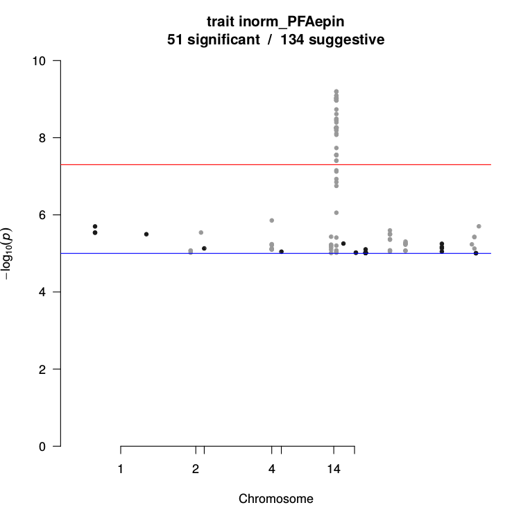

```{r setup, echo = FALSE, message = FALSE, cache = FALSE}
# set global chunk options
opts_chunk$set(fig.path = 'figure-ugcd/', cache.path = 'cache-ugcd/', echo = FALSE, cache = TRUE, 
  tidy = FALSE, 
  fig.width = 9, fig.height = 4.5, dev = 'png',
  warning = FALSE, message = TRUE)
# upload images automatically? (identity/imgur_upload)
opts_knit$set(upload.fun = identity)
```

```{r inc, cache = FALSE, message = FALSE, warning = FALSE}
library(plyr)
library(ggplot2)
library(gridExtra)

library(pander)

#theme_set(theme_light())
panderOptions('table.split.table', Inf)
panderOptions('knitr.auto.asis', FALSE)
panderOptions('table.emphasize.rownames', FALSE)

library(devtools)
load_all("~/git/ugcd/gait")
load_all("~/git/ugcd/solarius")
load_all("~/git/hemostat/lme4qtl")

library(RLRsim)
```

```{r par_plotting}
emphcol <- "#d94d3a" # See styles.css
emphcol2 <- "#2a7cdf" # blue #4387fd; blue2 #3c8ef3; blue3 #2a7cdf;
```

```{r local_fun}
lrt <- function(mod.null, mod.alt, df = 1) 
{ 
  lrt.stat <- function(l.null, l.alt) 2 * (-l.null + l.alt)
  
  if(isREML(mod.null) | isREML(mod.alt)) {
    message("refitting model(s) with ML (instead of REML)")
  }
  
  l.null <- ifelse(isREML(mod.null), logLikNum(refitML(mod.null)), logLikNum(mod.null))
  l.alt <- ifelse(isREML(mod.alt), logLikNum(refitML(mod.alt)), logLikNum(mod.alt))
  
  x <- lrt.stat(l.null, l.alt)
  pchisq(x, df = df, lower.tail = FALSE)
}

summaryCoef <- function(x, digits = max(3, getOption("digits") - 3),
  signif.stars = getOption("show.signif.stars"), signif.legend = FALSE) 
{ 
  printCoefmat(summary(x)$coefficients, zap.ind = 3, digits = digits, 
    signif.stars = signif.stars, signif.legend = signif.legend)
}
```

```{r dat, message = FALSE, warning = FALSE}
source("R/01-load-data.R")
```

```{r gf_snpf, message = FALSE, warning = FALSE}
load("data/snps.throm.gait2.RData") 
```

```{r include_cite, cache = FALSE, message = FALSE, warning = FALSE}
#library(knitcitations)
```

```{r knitcitations, cache = FALSE, message = FALSE, warning = FALSE}
#cite_options(linked = TRUE)
#cite_options(tooltip = TRUE)

#bib <- read.bibtex("mendeley.bib")
```

## About lme4qtl

<div style="float: right; font-size: 50%;">

<br/>
Source: [github.com/dmbates](https://github.com/dmbates)
</div>

<span class="emph">lme4qtl</span> $=$ an extension of the <span class="emph">lme4</span> R package

<br/>

<span class="emph">lme4qtl</span> $=$ <span class="emph">l</span>inear <span class="emph">m</span>ixed <span class="emph">e</span>ffects models 
<s>for</s> <span class="emph">4</span> 
<span class="emph">q</span>uantitative <span class="emph">t</span>rait <span class="emph">l</span>oci mapping


# lme4qtl applied to GAIT2

## lme4qtl applied to GAIT2

1. Risk model of Thrombosis
2. Use case: PFA as a new risk factor
3. Model of APTT

Intereseted to know more about lme4qtl? 

Please see the slides [bit.ly/1UiTZvQ](http://bit.ly/1UiTZvQ) introducing the lme4qtl R package.

## Risk model of Thrombosis

> * No covariates: meaning of prevalence
> * Basic model: age & gender
>     * How to code age?
>     * Is gender important?
> * Adding a genetic factor: ABO
>     * How to encode ABO?
> * Adding more genetic factors 
>     * <s>In TIC we trust</s>

## Use case: PFA as a new risk factor

> * PFAadp & PFAedp have been established as risk factors in RETROVE
>     * ABO is not available in RETROVE
> * Replication study in GAIT2
>     * ABO is available in GAIT2
>     * Measures of PFAadp & PFAedp are comparable across two cohorts
> * lme4qtl R packages handles the pedigrees
>     * SOLAR hasn't heard about logistic legression
>     * SOLAR has a special way to introduce the disease prevalence


## Model of APTT

* Sex-specificity
* Ageing
* Combined linkage and association

# Risk model of Thrombosis

## Thrombosis disease

Thrombosis is a common complex disease associated with substantial morbidity and mortality.

The major determinants of thrombosis include both environmental and genetic factors.

* Enironmental: age & gender
* Genetic: ABO blood group system ([wikipedia](https://en.wikipedia.org/wiki/ABO_blood_group_system))
    * Group O is protector

The contribution of genetic risk factors is estimated around 60% [@Souto2000]. 

## No covariates: meaning of prevalence

```{r no_cov, echo = T}
m <- relmatGlmer(Throm ~ (1|ID), phen2, relmat = list(ID = dkin2), 
  family = binomial)
```

```{r no_cov_par, dependson = -1}
b <- as.numeric(fixef(m))
prev1 <- prop.table(table(phen2$Throm))[["1"]]
prev2 <- 1 / (1 + exp(-b))
```

* Model intercept: $\beta_0 =$ `r round(b, 2)`
* Formula for the prevalence (logistic regression): $\frac{1}{1 + e^{-\beta_0}}$
<br/>

```{r tab_prev, dependson = -1, echo = FALSE, results = 'asis'}
# -}
df <- data.frame(Model = c("Proportion", "Mixed Model", "Reported in Literature"),
  Prevalence = c(paste0(round(100 * c(prev1, prev2), 2), "%"), "0.2 - 2%"))
  
pander(df, style = 'rmarkdown')
```

## Modeling prevalence?

```{r modeling_prev_plots}
source("R/figure/01-prevalence-gait1-gait2.R")
```

```{r modeling_prev, echo = TRUE}
K <- 0.02
dat <- mutate(phen2, offset = log(K/(1 - K)))
m <- relmatGlmer(Throm ~ -1 + AGEsc + (1|ID), dat, 
  offset = offset, relmat = list(ID = dkin2), family = binomial)
```

<div class="columns-2">

GAIT2 (118 _vs._ 817)

GAIT1 (53 _vs._ 340)

</div>

<div class="columns-2">

```{r p1, fig.width = 4, fig.height = 3}
p1
```

```{r p2, fig.width = 4, fig.height = 3}
p2
```

</div>

## Effects of age & gender

```{r age_gender_effects, echo = TRUE}
K <- 0.02
dat <- mutate(phen2, offset = log(K/(1 - K)))
m <- relmatGlmer(Throm ~ -1 + AGEsc + I(AGEsc^2) + SEXfnum + (1|ID), dat, 
  offset = offset, relmat = list(ID = dkin2), family = binomial)
stats <- drop1(m, test = "Chisq")
```

```{r tab_age_gender_effects, dependson = -1, echo = FALSE, results = 'asis'}
df <- as.data.frame(stats)
df <- df[-1, 4, drop = FALSE]
colnames(df) <- c("P-value")
pander(df, style = 'rmarkdown', digits = 3) 
```

## AGE^2 is not significant?

<div style="float: right;">

```{r logistic, fig.width = 2, fig.height = 3}
p1
```

</div>


Does that mean there is no non-linear trend?

* Could be true for the linear regression   
    * model: `APTT ~ AGE + AGE^2`
* Not the case for the logistic regression 
    * model: `Throm ~ AGE + AGE^2`

<br/>

See also [@Vazquez2016]

## Non-linear age effect

```{r tab_AGEf}
tab <- ddply(phen2, "AGEf", summarize, 
  Range = paste("[", 
    paste(round(range(AGE, na.rm = TRUE), 1), collapse = " - "), 
    "]", collapse = ""), 
  N = sum(!is.na(AGE)))
```

```{r, dependson = -1, results = 'asis'}
tab <- tab[1:5, ]

colnames(tab) <- c("Factor level of AGE", "Range of AGE", "Number of ind.")
rownames(tab) <- c("< 55", "55 - 64", "65 - 74", "75 - 84", "> 85")
pander(tab, style = 'rmarkdown')
```


## Non-linear age effect

```{r age_effects, echo = TRUE}
K <- 0.05
dat <- mutate(phen2, offset = log(K/(1 - K)))
m <- relmatGlmer(Throm ~ -1 + AGEfnum1 + AGEfnum2 + AGEfnum3 + AGEfnum4 + SEXfnum + (1|ID), dat, 
  offset = offset, relmat = list(ID = dkin2), family = binomial)
stats <- drop1(m, test = "Chisq")
```

```{r orf}
orf <- exp(cbind(fixef(m)[1:4], 
  confint(m, parm = names(fixef(m)[1:4]), method = "Wald", level = 0.9)))
orf <- data.frame(rownames(orf), orf, c(2.25, 4.09, 5.37, 12.60))

names(orf) <- c("AGEf", "OR", "CIlow", "CIhigh", "ORtic")  
```

```{r tab_age_effects, dependson = -1, echo = FALSE, results = 'asis'}
df <- as.data.frame(stats)
df <- df[2:5, 4, drop = FALSE]

df <- cbind(orf[, 2:4], df)
rownames(df) <- c("55 - 64", "65 - 74", "75 - 84", "> 85")
colnames(df) <- c("Odds", "CI 5%", "CI 95%", "P-value")
pander(df, style = 'rmarkdown', digits = 3) 
```

## ORs + 90% CI _vs._ <span class="emph2">ORs in TiC</span>

```{r plot_orf, fig.width = 8}
labs <- c("55 - 64", "65 - 74", "75 - 84", "> 85")
p <- ggplot(orf, aes(AGEf, OR)) + geom_point(size = 3) + geom_errorbar(aes(ymin = CIlow, ymax = CIhigh), width = 0.1) + geom_point(aes(AGEf, ORtic), size = 3, color = emphcol)

p <- p + scale_x_discrete(labels = labs) + labs(x = "", y = "")
p <- p + theme_linedraw(base_size = 20)


p
```

Is that publishable? Ask Sr. Tripodi about his article in Blood.

## Encoding ABO: allele O {.smaller}

```{r abo_stat}
sf <- ddply(phen2, "ABO", summarize, 
  Code_0 = sum(ABOf3 == 0), 
  Code_1 = sum(ABOf3 == 1), 
  Code_2 = sum(ABOf3 == 2))

sf <- sf[with(sf, order(Code_0, Code_1, Code_2)), ]  
```

```{r tab_abo_stat, dependson = -1, echo = FALSE, results = 'asis'}
rownames(sf) <- NULL
pander(sf, style = 'rmarkdown') 
```

## Encoding ABO: allele A1 {.smaller}

```{r abo_stat_A1}
sf <- ddply(phen2, "ABO", summarize, 
  Code_0 = sum(ABOf3A1 == 0), 
  Code_1 = sum(ABOf3A1 == 1), 
  Code_2 = sum(ABOf3A1 == 2))

sf <- sf[with(sf, order(Code_0, Code_1, Code_2)), ]  
```

```{r tab_abo_stat_A1, dependson = -1, echo = FALSE, results = 'asis'}
rownames(sf) <- NULL
pander(sf, style = 'rmarkdown') 
```

## Adding ABO genetic factor  

```{r model_abo, echo = T}
K <- 0.05
dat <- mutate(subset(phen2, !is.na(ABOf3num)), offset = log(K/(1 - K)))

m <- relmatGlmer(Throm ~ -1 + AGEsc + AGEsc2 + SEXfnum + ABOf3num + (1|ID), dat, 
  offset = offset, relmat = list(ID = dkin2), family = binomial)
```

```{r model_abo_tab, dependson = -1}
tab <- summary(m)$coefficients
stats <- drop1(m, test = "Chisq")
```

```{r tab_abo, dependson = -1, echo = FALSE, results = 'asis'}
tab <- cbind(tab[, 1:2], as.data.frame(stats)[-1, 4, drop = FALSE])

colnames(tab)[3] <- "P-value"
pander(tab, style = 'rmarkdown', digits = 3) 
```

## Adding more genetic factors

Two perpectives

1. GWAS
2. Risk models (logistic regression)

## The most modern GWAS

GWAS of self-reported events in 6,135 individuals and 252,827
controls identifies 8 thrombosis-related loci [@Hinds2016]:

 * F5, FGA-FGG, F11, F2, PROCR, and ABO
 * Recently discovered locus near SLC44A2

<div class="imgblock">

</div>


## Known SNPs & Relative Risks (10/26) {.smaller}

```{r tab_snpf}
tab <- subset(snpf, select = c("Marker", "RR", "Gene", "MAF", "GAIT2"))
```

```{r tab_snpf1, echo = FALSE, results = 'asis'}
pander(tab[1:10, 1:4], style = 'rmarkdown', digits = 3) 
```

## Protocol

Data preparation

* Remove SNPs not presented in GAIT2 
* Remove SNPs with MAF < 5%

<br/>

Selection of SNPs

1. The null model: age & gender
2. Add one SNP at a time
3. Select the most significant one (if any)
4. Go to step 2

## SNPs out of the analysis

```{r snpf_out, echo = FALSE, results = 'asis'}
tab <- subset(snpf, maf.imputed < 0.05 | !GAIT2)
tab <- subset(tab, select = c("Marker", "RR", "Gene", "MAF", "maf.imputed", "GAIT2"))

pander(tab, style = 'rmarkdown', digits = 3) 
```

## Final multi-marker model

```{r multi_snp, echo = TRUE, eval = FALSE}
m <- relmatGlmer(Throm ~ AGEsc + AGEsc2 + SEXfnum + rs8176719 + rs2036914 + rs2288904 + (1|ID), dat, 
  relmat = list(ID = dkin2), family = binomial)
```

<br/>

```{r multi_snp_tab}
load("results/models.snps.run2.RData")
m <- models.snps3$rs2288$model
```

```{r multi_snp_tab_2, results = 'asis'}
orf <- as.data.frame(exp(cbind(fixef(m)[5:7], 
  confint(m, parm = names(fixef(m))[5:7], method = "Wald", level = 0.9)))^(-1))

colnames(orf) <- c("OR", "CIhigh", "CIlow")  

orf <- data.frame(Marker = rownames(orf), OR = orf$OR,
  CIlow = orf$CIlow, CIhigh = orf$CIhigh)

pvals <- summary(m)$coefficients[5:7, 4]
pf <- data.frame(Marker = names(pvals), pval = pvals)

df <- join(orf, pf, by = "Marker")

df <- join(df, subset(snpf, select = c("Marker", "Gene", "RR")), by = "Marker")

rownames(df) <- NULL
colnames(df)[1:5] <- c("Marker", "Odds", "CI 5%", "CI 95%", "P-value")
pander(df, style = 'rmarkdown', digits = 3) 
```

## GAIT2 is comparable to 23andme? {.smaller}

* In both cohors: FGA-FGG, F11, PROCR, SLC44A2, and ABO (O-related SNP)
* Excluded in GAIT2: F5, F2, and ABO (A1-related SNP MAF 0.04)
* Other risk markers:
    * F12 SNP affects on FXIIc or Throm?
    * SERPINC1/SERPINA10/Cambridge are rare

<div class="imgblock">

</div>

## ABO SNPs

From the literature review of risky SNPs:

|  Allele | SNP |
|:-------|:------|
| O | rs8176719 |
| A1 | rs8176750 |

<br/>

[@Van2015] :

> Blood group antigen phenotypes (O and non-O) were reconstructed
> using genotype data of rs687289:C4T, which is a marker for the O allele. [26]

## ABO in RETROVE?

Use rs687289:C4T to define blood antigen phenotypes (O and non-O)?


# Use case | PFA as a new risk factor: discovered in RETROVE

```{r pfa, message = FALSE, warning = FALSE}
source("R/17-throm-risk-model-pfa.R")
```

## Results in RETROVE

Shortened times of both PFAadp & PFAepin (10% quantile)
have been found to be risk factors

* Base model used for comparison included: age & gender
* ABO factor was omitted (data not measured in RETROVE)

## GWAS of PFA phenotypes in GAIT2

<div class="columns-2">

<div class="imgblock">

</div>

<div class="imgblock">

</div>

</div>

## Protocol in GAIT2

* Define quantile 10% based on controls in GAIT2
* Use rs8176719 (934) instead of ABO genotype (913)
* Use lme4qtl to take into account related individuals

## Results in GAIT2

```{r local_f}
mod2odds <- function(m) 
{
  vals <- tail(exp(cbind(fixef(m), confint(m, method = "Wald", parm = names(fixef(m))))), 1)
  vals <- round(vals, 2)
  
  str <- paste0(vals[1], " [", vals[2], "; ", vals[3], "]")
  
  return(str)
}

mod2pval <- function(m0, m) 
{
  as.data.frame(anova(m0, m))[2, 8]
}
```

```{r pfa_tab, results = 'asis'}
df <- data.frame(Model = c("Throm ~ AGE + AGE^2 + SEX + PFAadp_q10", "Throm ~ AGE + AGE^2 + SEX + rs8176719 + PFAadp_q10"),
  Odds = c(mod2odds(m1), mod2odds(mod1)), Pvalue = c(mod2pval(m10, m1), mod2pval(mod10, mod1)))

rownames(df) <- NULL
pander(df, style = 'rmarkdown', digits = 3) 
```

<br/>

```{r pfa_tab2, results = 'asis'}
df <- data.frame(Model = c("Throm ~ AGE + AGE^2 + SEX + PFAepin_q10", "Throm ~ AGE + AGE^2 + SEX + rs8176719 + PFAepin_q10"),
  Odds = c(mod2odds(m2), mod2odds(mod2)), Pvalue = c(mod2pval(m20, m2), mod2pval(mod20, mod2)))

rownames(df) <- NULL
pander(df, style = 'rmarkdown', digits = 3) 
```

## Summary on PFA in GAIT2

We can not conclude the interplay effect between PFA & AB0.

* PFA shows no significant effect in any model.

<br/>

Can be GAIT2 used to replicate results in RETROVE?

* Most GAIT2 affected have multiple thrombotic events
* Relatedness can be corrected by lme4qtl
    * GAIT2 is biased due to family history (risk factor)
    * MARTHA is biased due to FV/PT factors

# Conclusions

## What next?

> * Re-run GWAS on diseases
>     * Take into account the prevalence
>     * Take into account known markers [@Zaitlen2012]
> * Run ageing & sex-specificity models
>     * Use GAW sample (GAIT1 showed no results)
> * Run risk model of Thrombosis with 10M markers
>     * regularized mixed models (todo lme4qtl)
> * Run multi-level model for CVI
>     * ordered logistic regerssion (todo lme4qtl)    

# Thank you

## References
