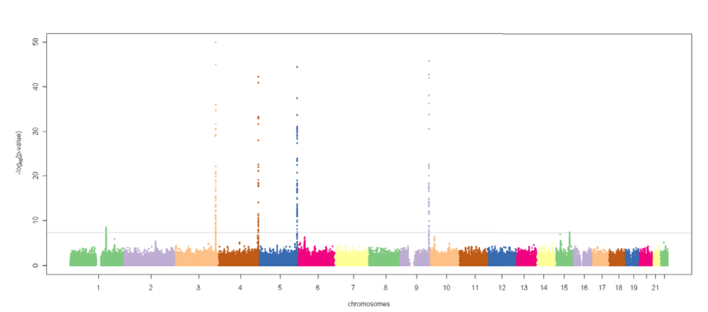

```{r setup, echo = FALSE, message = FALSE, cache = FALSE}
# set global chunk options
opts_chunk$set(fig.path = 'figure/', cache.path = 'cache/', echo = FALSE, cache = TRUE, 
  tidy = FALSE, 
  fig.width = 9, fig.height = 4.5, dev = 'png',
  warning = FALSE, message = TRUE)
# upload images automatically? (identity/imgur_upload)
opts_knit$set(upload.fun = identity)
```

```{r inc, cache = FALSE, message = FALSE, warning = FALSE}
library(plyr)
library(ggplot2)
library(gridExtra)

library(pander)

#theme_set(theme_light())
panderOptions('table.split.table', Inf)
panderOptions('knitr.auto.asis', FALSE)

library(devtools)
load_all("~/git/ugcd/solarius")
load_all("~/git/hemostat/lme4qtl")

library(RLRsim)
```

```{r par_plotting}
emphcol <- "#d94d3a" # See styles.css
emphcol2 <- "#2a7cdf" # blue #4387fd; blue2 #3c8ef3; blue3 #2a7cdf;
```

```{r local_fun}
lrt <- function(mod.null, mod.alt, df = 1) 
{ 
  lrt.stat <- function(l.null, l.alt) 2 * (-l.null + l.alt)
  
  if(isREML(mod.null) | isREML(mod.alt)) {
    message("refitting model(s) with ML (instead of REML)")
  }
  
  l.null <- ifelse(isREML(mod.null), logLikNum(refitML(mod.null)), logLikNum(mod.null))
  l.alt <- ifelse(isREML(mod.alt), logLikNum(refitML(mod.alt)), logLikNum(mod.alt))
  
  x <- lrt.stat(l.null, l.alt)
  pchisq(x, df = df, lower.tail = FALSE)
}

summaryCoef <- function(x, digits = max(3, getOption("digits") - 3),
  signif.stars = getOption("show.signif.stars"), signif.legend = FALSE) 
{ 
  printCoefmat(summary(x)$coefficients, zap.ind = 3, digits = digits, 
    signif.stars = signif.stars, signif.legend = signif.legend)
}
```

```{r dat, message = FALSE, warning = FALSE}
source("R/01-load-data.R")
```

```{r include_cite, cache = FALSE, message = FALSE, warning = FALSE}
#library(knitcitations)
```

```{r knitcitations, cache = FALSE, message = FALSE, warning = FALSE}
#cite_options(linked = TRUE)
#cite_options(tooltip = TRUE)

#bib <- read.bibtex("mendeley.bib")
```

## About this talk

* Not really a talk (too long)
* Like an R package vignette (as long as necessary)

## About lme4qtl

<span class="emph">lme4qtl</span> $=$ an extension of the <span class="emph">lme4</span> R package

<br/>

<span class="emph">lme4qtl</span> $=$ <span class="emph">l</span>inear <span class="emph">m</span>ixed <span class="emph">e</span>ffects models 
<s>for</s> <span class="emph">4</span> 
<span class="emph">q</span>uantitative <span class="emph">t</span>rait <span class="emph">l</span>oci mapping


## About lme4qtl user

1. You use mixed models for QTL mapping 
    * Basic models <span class="emph">(efficiency)</span>
    * Advanced models <span class="emph">(flexibility)</span>
2. You code in R
    * If not, just need to learn the formula interface
3. You are a fan of the [lme4](https://github.com/lme4/lme4) R package
    * If not, [dmbates](https://github.com/dmbates) is watching you


<div style="float: right; font-size: 50%;">

<br/>
Source: [github.com/dmbates](https://github.com/dmbates)
</div>

# Implementation

## 2-column Layout

<div class="columns-2">
  - Bullet 1
  - Bullet 2
  - Bullet 3

  image.png
</div>

# Results | QTL mapping examples using lme4qtl

## Examples / Models

* Polygenic (quantitative trait)
* Polygenic (binary trait)
* Polygenic (counts)

<br/>

* Association (quantitative trait)
* Linkage (quantitative trait)

<br/>

* GxE (sex-especificity)
* GxE (ageing)

## Data preparation

1. Write the formula of your model
2. Write your data table into a data frame
3. Compute the relation matrix across your grouping IDs

```{r, echo = TRUE, eval = FALSE}
relmatLmer(
  myTrait ~ myCovariate + (1|myID),  # 1
  myData,                            # 2
  relmat = list(myID = myMatrix)     # 3
)
```

## Description of the GAIT data {.smaller}

|  R objects |  Description  |
|:-----------|:--------------|
| phen/phen2 | A data frame with phenotypes and IDs (GAIT1/GAIT2) |
| dkin/dkin2 | The double kinship matrix with IDs in row/columns names (GAIT1/GAIT2)|

## Description of the GAIT data (variables) {.smaller}

|  Variables in phen  | Type | Project | Description  |
|:-----------|:-----|:--------|:-------------|
| ID  | character | |The individual's ID (must be unique)|
| HHID | character | |The individual's house-hold ID |
| SEXf | factor | |The gender (Male/Female) |
| AGE/AGEc/AGEsc |numeric | |The age (raw/centered/scaled) |
| AGEc2/AGEsc2 | numeric | |The age squared (centered/scaled) |
| APTT | numeric | GAIT1 | Activated Partial Thromboplastin Time (units, sec) |
| Throm | factor | GAIT2 | The thrombosis disease status (control/affected) |


## Models (1/7)

<div style="float: right;">
```{r plot_mod_aptt, fig.width = 4, fig.height = 4}
N <- 20

m <- relmatLmer(APTT ~ AGEc + (1|ID), phen, relmat = list(ID = dkin))

dat <- subset(phen, !is.na(APTT))
set.seed(1)
ind <- sample(seq(1, nrow(dat)), N)
dat <- dat[ind, ]

dat$yf <- predict(m, dat, re.form = NA)
dat$yr <- predict(m, dat, re.form = NULL)

ggplot(dat) + 
  geom_line(aes(AGE, yf), color = emphcol, size = 2) + 
  geom_point(aes(AGE, APTT)) + 
  geom_point(aes(AGE, yr), color = emphcol) + 
  geom_segment(aes(x = AGE, y = yr, xend = AGE, yend = APTT), linetype = 3) +
  theme_void()
```
</div>

* <span class="emph">Polygenic (quantitative trait)</span>
* Polygenic (binary trait)
* Polygenic (counts)

<br/>

* Association (quantitative trait)
* Linkage (quantitative trait)

<br/>

* GxE (sex-especificity)
* GxE (ageing)

## APTT phenotype

Activated partial thromboplastin time (APTT) is a clinical test used
to screen for coagulation-factor deficiencies.

Associations with KNG1, HRG, F11, F12, and ABO were confirmed 
in a meta-anaysis of 9,240 individuals (European ancestry) [@Tang2012]

<div class="imgblock">

</div>

## Polygenic model for APTT

```{r aptt, echo = T}
m <- relmatLmer(APTT ~ AGEsc + (1|ID), phen, relmat = list(ID = dkin))
m
```

## Residuals

```{r aptt_res, echo = T}
r <- residuals(m)
```

<div class="columns-2">

```{r aptt_res_1, fig.width = 4, fig.height = 4, echo = T}
qqnorm(r); qqline(r)
```

```{r aptt_res_2, fig.width = 4, fig.height = 4, echo = T}
hist(r, breaks = 30)
```

</div>

## Drop fixed effects

```{r cont_fixed_eff, echo = TRUE}
m <- relmatLmer(APTT ~ AGEsc + I(AGEsc^2) + SEXf + (1|HHID) + (1|ID), 
  phen, relmat = list(ID = dkin), REML = FALSE)
```

```{r cont_fixed_eff2, dependson = -1, echo = TRUE}
drop1(m, test = "Chisq")
```

## Anova

```{r cont_anova, echo = TRUE}
m <- relmatLmer(APTT ~ AGEsc + I(AGEsc^2) + SEXf + (1|HHID) + (1|ID), 
  phen, relmat = list(ID = dkin))
```

```{r cont_anova2, dependson = -1, echo = TRUE}
m0 <- update(m, . ~ . - (1|HHID))
anova(m, m0) 
```


## Exact Restricted LRT (single effect)

```{r cont_exact_lrt, echo = TRUE}
m <- relmatLmer(APTT ~ AGEsc + I(AGEsc^2) + SEXf + (1|ID), 
  phen, relmat = list(ID = dkin))
```

```{r cont_cont_exact_lrt1, dependson = -1, echo = TRUE}
library(RLRsim)
exactRLRT(m)
```

## Exact Restricted LRT (many effects)

```{r cont2_exact_lrt, echo = TRUE}
m <- relmatLmer(APTT ~ AGEsc + I(AGEsc^2) + SEXf + (1|ID), 
  phen, relmat = list(ID = dkin))
m0 <- update(m, . ~ . + (1|HHID))  
```

```{r cont_cont_exact_lrt2, dependson = -1, echo = TRUE}
library(RLRsim)
exactRLRT(m0, mA = m, m0 = m0)
```


## Models (2/7)

<div style="float: right;">

```{r plot_mod_Throm_comp}
N <- 50

K <- 0.05
dat <- mutate(phen2, offset = log(K/(1 - K)))

m <- relmatGlmer(Throm ~ -1 + AGEsc + SEXfnum + (1|ID), dat, offset = offset, relmat = list(ID = dkin2), family = binomial)
m0 <- relmatGlmer(Throm ~ AGEsc + SEXfnum + (1|ID), dat, relmat = list(ID = dkin2), family = binomial) 
  
dat <- subset(phen2, !is.na(AGEsc))
set.seed(1)
ind <- sample(with(dat, which(SEXfnum == 0)), N)
dat <- dat[ind, ]

beta0 <- log(K/(1 - K))
logit <- function(x) 1/(1 + exp(-x))

dat$y <- predict(m, dat, re.form = NULL)
dat$yf <- predict(m, dat, re.form = NA)
dat <- mutate(dat, prob = logit(y + beta0))
dat <- mutate(dat, probf = logit(yf + beta0))

simdat <- data.frame(AGEsc = seq(-2.5, 5, 0.05), SEXfnum = 0)
simdat$y <- predict(m, simdat, re.form = NA)
simdat$y0 <- predict(m0, simdat, re.form = NA)
simdat <- mutate(simdat, prob = logit(y + beta0))
simdat <- mutate(simdat, prob0 = logit(y0))

p1 <- ggplot(simdat) + 
  geom_line(aes(AGEsc, prob), color = emphcol, size = 2) +
  geom_line(aes(AGEsc, prob0), color = emphcol, size = 2, linetype = 3) +
  geom_point(aes(AGEsc, as.numeric(Throm), shape = as.factor(Throm)), dat, size = 2) +
  geom_hline(yintercept = 0.5, linetype = 2) +
  geom_vline(xintercept = 0, linetype = 2) +
  scale_shape_manual(values = c(1, 19)) + guides(shape = "none") + theme_void()
```

```{r plot_mod_aff_comp}
N <- 50

K <- 0.05
dat <- mutate(phen, offset = log(K/(1 - K)))

m <- relmatGlmer(aff ~ -1 + AGEsc + SEXfnum + (1|ID), dat, offset = offset, relmat = list(ID = dkin), family = binomial)
m0 <- relmatGlmer(aff ~ AGEsc + SEXfnum + (1|ID), dat, relmat = list(ID = dkin), family = binomial) 
  
dat <- subset(phen, !is.na(AGEsc))
set.seed(1)
ind <- sample(with(dat, which(SEXfnum == 0)), N)
dat <- dat[ind, ]

beta0 <- log(K/(1 - K))
logit <- function(x) 1/(1 + exp(-x))

dat$y <- predict(m, dat, re.form = NULL)
dat$yf <- predict(m, dat, re.form = NA)
dat <- mutate(dat, prob = logit(y + beta0))
dat <- mutate(dat, probf = logit(yf + beta0))

simdat <- data.frame(AGEsc = seq(-2.5, 5, 0.05), SEXfnum = 0)
simdat$y <- predict(m, simdat, re.form = NA)
simdat$y0 <- predict(m0, simdat, re.form = NA)
simdat <- mutate(simdat, prob = logit(y + beta0))
simdat <- mutate(simdat, prob0 = logit(y0))

p2 <- ggplot(simdat) + 
  geom_line(aes(AGEsc, prob), color = emphcol, size = 2) +
  geom_line(aes(AGEsc, prob0), color = emphcol, size = 2, linetype = 3) +
  geom_point(aes(AGEsc, as.numeric(aff), shape = as.factor(aff)), dat, size = 2) +
  geom_hline(yintercept = 0.5, linetype = 2) +
  geom_vline(xintercept = 0, linetype = 2) +
  scale_shape_manual(values = c(1, 19)) + guides(shape = "none") + theme_void()
```

```{r plot_mod_logit, fig.width = 4, fig.height = 4}
#grid.arrange(p1, p2, ncol = 1) # fig.width = 4, fig.height = 2*2.5
p1
```

</div>

* Polygenic (quantitative trait)
* <span class="emph">Polygenic (binary trait)</span>
* Polygenic (counts)

<br/>

* Association (quantitative trait)
* Linkage (quantitative trait)

<br/>

* GxE (sex-especificity)
* GxE (ageing)


## Polygenic model for Throm

```{r m1, echo = TRUE}
m <- relmatGlmer(Throm ~ (1|ID), phen2, relmat = list(ID = dkin2), 
  family = binomial)
m
```

## Covariates

```{r throm_cov2, echo = TRUE}
m <- relmatGlmer(Throm ~ AGEsc + SEXf + ABOf3num + (1|ID), phen2, 
  relmat = list(ID = dkin2), family = binomial)
```

```{r, echo = TRUE}
summaryCoef(m, signif.legend = TRUE)
```


## Disease prevalence 5%

```{r throm_prevalence, echo = TRUE}
K <- 0.05
dat <- mutate(phen2, offset = log(K/(1 - K)))

m <- relmatGlmer(Throm ~ -1 + AGEsc + SEXfnum + ABOf3num + (1|ID), dat, 
  offset = offset, relmat = list(ID = dkin2), family = binomial)
```

```{r, dependson = -1, echo = T}
summaryCoef(m) # offset = log(K/(1 - K)) = -2.944439
```

## Probit link function

```{r probit, echo = TRUE}
K <- 0.05
dat <- mutate(phen2, offset = -qnorm(1 - K))

m <- relmatGlmer(Throm ~ -1 + AGEsc + SEXfnum + ABOf3num + (1|ID), dat, 
  offset = offset, relmat = list(ID = dkin2), family = binomial(probit))  
```

```{r, echo = TRUE}
summaryCoef(m)  # offset = -qnorm(1 - K) = -1.644854
```

See also [@Zaitlen2012]

## Modeling prevalence?

<div class="columns-2">

GAIT2 (118 _vs._ 817)

GAIT1 (53 _vs._ 340)

</div>

<div class="columns-2">

```{r p1, fig.width = 4, fig.height = 4.5}
p1
```

```{r p2, fig.width = 4, fig.height = 4.5}
p2
```

</div>

## Models (3/7)

<div style="float: right;">

```{r plot_mod_counts}
p <- ggplot(phen2, aes(PTES)) + geom_histogram(binwidth = 20, color = "white", fill = emphcol)

p <- p + theme_void()
```

```{r plot_mod_counts2, dependson = -1, fig.width = 3.5, fig.height = 4}
p
```

</div>

* Polygenic (quantitative trait)
* Polygenic (binary trait)
* <span class="emph">Polygenic (counts)</span>

<br/>

* Association (quantitative trait)
* Linkage (quantitative trait)

<br/>

* GxE (sex-especificity)
* GxE (ageing)


## Polygenic model of PTES

```{r ptes, echo = TRUE}
m <- relmatGlmer(PTES ~ AGEsc + AGEsc2 + SEXf + (1|ID), phen2, 
  relmat = list(ID = dkin2), family = poisson)
```

```{r show_ptes, dependson  = -1, echo = TRUE}
m
```

## Models (4/7)

<div style="float: right;">

```{r plot_mod_assoc}
dat <- subset(phen, !is.na(ab0))
m0 <- relmatLmer(APTT ~ AGEsc + (1|ID), dat, relmat = list(ID = dkin))
m <- update(m0, . ~. + ab0)

pdat <- subset(dat, select = c("APTT", "AGEsc", "ab0", "ID"))
pdat <- within(pdat, {
  AGEsc <- 0
})

pdat$y <- predict(m, dat, re.form = NA)

### plot
p <- ggplot(pdat, aes(as.factor(ab0), y)) + geom_boxplot(color = emphcol) 
p <- p + theme_void()
```

```{r plot_mod_assoc2, dependson = -1, fig.width = 3.5, fig.height = 4}
p
```

</div>

* Polygenic (quantitative trait)
* Polygenic (binary trait)
* Polygenic (counts)

<br/>

* <span class="emph">Association (quantitative trait)</span>
* Linkage (quantitative trait)

<br/>

* GxE (sex-especificity)
* GxE (ageing)


## Association between APTT and AB0

```{r assoc, echo = TRUE}
dat <- subset(phen, !is.na(ab0))
m0 <- relmatLmer(APTT ~ AGEsc + (1|ID), dat, relmat = list(ID = dkin))
```

```{r assoc_anova, dependson  = -1, echo = TRUE}
m <- update(m0, . ~. + ab0)
anova(m0, m)
```

# lme4qtl is <span class="emph">flexible</span> | AB0 influences both mean and variance of APTT <br/> *Not the same as in [@Chen2007]


## AB0 fixed and random effects

```{r assoc2, echo = TRUE}
dat <- subset(phen, !is.na(ab0))
m0 <- relmatLmer(APTT ~ AGEsc + (1|ID), dat, relmat = list(ID = dkin))
```

```{r assoc2_anova, echo = TRUE}
m1 <- update(m0, . ~. + ab0)
m2 <- update(m0, . ~. + ab0 + (1|ab0))
anova(m1, m2)
```

## Contribution of AB0 random effect

Additional variance explained by ABO is small,
while df $=$ 2

```{r assoc2_m2, echo = TRUE}
m2
```


## Models (5/7)

```{r plot_mod_link}
#ids <- with(phen, ID[FAMID == "01"])[1:10]
ids <- c("01101", "01102",
  "01202", "01203", "01205", "01208", "01210",
  "01204", "01209", "01211")

# kinsip
ind <- rownames(dkin) %in% ids
mat <- dkin[ind, ind]

pf <- melt(mat) # Var1 Var2 value
pf <- mutate(pf,
  Var1 = factor(Var1, levels = as.numeric(ids)),  
  Var2 = factor(Var2, levels = rev(as.numeric(ids))))
  
p1 <- ggplot(pf, aes(Var1, Var2)) + geom_tile(aes(fill = value), color = "white") + 
  scale_fill_gradient(low = "white", high = emphcol)

p1 <- p1 + guides(fill = "none") + theme_void()

# mibd
f <- system.file("extdata/gait1/mibd.5.200.gz", package = "gait")
  
mf <- read_mibd_csv_gz(f)
mf <- mf[, 1:3]

mf <- subset(mf, ID1%in% ids & ID2 %in% ids)
mat <- mf2mat(mf)

pf <- melt(mat) # Var1 Var2 value
pf <- mutate(pf,
  Var1 = factor(Var1, levels = as.numeric(ids)),  
  Var2 = factor(Var2, levels = rev(as.numeric(ids))))

p2 <- ggplot(pf, aes(Var1, Var2)) + geom_tile(aes(fill = value), color = "white") + 
  scale_fill_gradient(low = "white", high = emphcol)

p2 <- p2 + guides(fill = "none") + theme_void()
```

<div style="float: right;">
```{r plot_mod_link1, dependson = -1, fig.width = 2, fig.height = 2}
p1
```

```{r plot_mod_link2, dependson = c(-1, -2), fig.width = 2, fig.height = 2}
p2
```
</div>

* Polygenic (quantitative trait)
* Polygenic (binary trait)
* Polygenic (counts)

<br/>

* Association (quantitative trait)
* <span class="emph">Linkage (quantitative trait)</span>

<br/>

* GxE (sex-especificity)
* GxE (ageing)


## Locus F12 and related MIBD matrix

```{r link_mibd, echo = TRUE}
f <- system.file("extdata/gait1/mibd.5.200.gz", package = "gait")

library(solarius)
mf <- read_mibd_csv_gz(f)
mibd <- Matrix(mf2mat(mf))
```

```{r, echo = TRUE}
mibd[1:7, 1:7] # a sub-matrix of 449 x 449
```

## Locus F12 linked to APTT

```{r link_aptt, echo = TRUE}
dat <- mutate(phen, IBDID = ID)

m <- relmatLmer(APTT ~ AGEsc + (1|ID) + (1|IBDID), dat, 
  relmat = list(ID = dkin, IBDID = mibd), REML = FALSE)

m0 <- update(m, . ~ . - (1|IBDID))

# anova(m, m0)
(LOD <- (logLikNum(m) - logLikNum(m0)) / log(10))
```

## Locus F12 linked to FXII

```{r link_fxii, echo = TRUE}
m <- relmatLmer(FXII ~ (1|ID) + (1|IBDID), dat, 
  relmat = list(ID = dkin, IBDID = mibd), REML = FALSE)

m0 <- update(m, . ~ . - (1|IBDID))

# anova(m, m0)
(LOD <- (logLikNum(m) - logLikNum(m0)) / log(10))
```

# lme4qtl is <span class="emph">flexible</span> | Combined linkage-association model <br/> *Aslmost the same model as in [@Chen2007]

## Combined linkage-association model

```{r link_assoc_fxii, echo = TRUE}
dat <- mutate(subset(phen, !is.na(c46t)), IBDID = ID)
m <- relmatLmer(FXII ~ c46t + (1|ID) + (1|IBDID), dat, 
  relmat = list(ID = dkin, IBDID = mibd))
m0 <- update(m, . ~ . - c46t - (1|IBDID))

anova(m, m0)
```

## Which of two genetic components?

```{r link_assoc_fxii2, echo = TRUE}
dat <- mutate(subset(phen, !is.na(c46t)), IBDID = ID)

m <- relmatLmer(FXII ~ c46t + (1|ID) + (1|IBDID), dat, 
  relmat = list(ID = dkin, IBDID = mibd))

m0 <- update(m, . ~ . - c46t - (1|IBDID))

m1 <- update(m, . ~ . - c46t)
m2 <- update(m, . ~ . - (1|IBDID))
```

## c46t (fixed effect) is the key player

```{r link_assoc_fxii3, echo = TRUE}
anova(m, m0, m1, m2)
```

## Models (6/7)

```{r plot_mod_linkdxg, message = FALSE}
ids <- c("01101", "01102",
  "01202", "01205", "01210", "01203", "01208",
  "01211", "01204", "01209")

# kinship
ind <- rownames(dkin) %in% ids
mat <- dkin[ind, ind]

pf <- melt(mat) # Var1 Var2 value
pf <- mutate(pf,
  Var1 = factor(Var1, levels = as.numeric(ids)),  
  Var2 = factor(Var2, levels = rev(as.numeric(ids))))

pf <- join(pf, data.frame(Var1 = as.numeric(phen$ID), SEX1 = phen$SEX))
pf <- join(pf, data.frame(Var2 = as.numeric(phen$ID), SEX2 = phen$SEX))

pf <- mutate(pf,
  value = ifelse(SEX1 == 1 & SEX2 == 1, -value, 
    ifelse(SEX1 == 2 & SEX2 == 2, value, 0)))

p3 <- ggplot(pf, aes(Var1, Var2)) + geom_tile(aes(fill = value), color = "white") + 
  scale_fill_gradient2(low = emphcol2, mid = "white", high = emphcol, na.value = "grey80")

p3 <- p3 + guides(fill = "none") + theme_void()

# mibd
f <- system.file("extdata/gait1/mibd.5.200.gz", package = "gait")
  
mf <- read_mibd_csv_gz(f)
mf <- mf[, 1:3]

mf <- subset(mf, ID1%in% ids & ID2 %in% ids)
mat <- mf2mat(mf)

pf <- melt(mat) # Var1 Var2 value
pf <- mutate(pf,
  Var1 = factor(Var1, levels = as.numeric(ids)),  
  Var2 = factor(Var2, levels = rev(as.numeric(ids))))

pf <- join(pf, data.frame(Var1 = as.numeric(phen$ID), SEX1 = phen$SEX))
pf <- join(pf, data.frame(Var2 = as.numeric(phen$ID), SEX2 = phen$SEX))

pf <- mutate(pf,
  value = ifelse(SEX1 == 1 & SEX2 == 1, -value, 
    ifelse(SEX1 == 2 & SEX2 == 2, value, 0)))

p4 <- ggplot(pf, aes(Var1, Var2)) + geom_tile(aes(fill = value), color = "white") + 
  scale_fill_gradient2(low = emphcol2, mid = "white", high = emphcol, na.value = "grey80")

p4 <- p4 + guides(fill = "none") + theme_void()
```

<div style="float: right;">
```{r plot_mod_linkdxg1, dependson = -1, fig.width = 2, fig.height = 2}
p1
```

```{r plot_mod_linkdxg2, dependson = c(-1, -2), fig.width = 2, fig.height = 2}
p3
```
</div>

* Polygenic (quantitative trait)
* Polygenic (binary trait)
* Polygenic (counts)

<br/>

* Association (quantitative trait)
* Linkage (quantitative trait)

<br/>

* <span class="emph">GxE (sex-especificity)</span>
* GxE (ageing)


## Sex-specificity for BMI (GAIT1)

```{r bmi_gait1_11, echo = TRUE}
# Common polygenic model
m0 <- relmatLmer(
  BMI ~ AGEsc + AGEsc2 + SEXf + (1|HHID) + (1|ID), 
  phen, relmat = list(ID = dkin))

# Sex-specificity only in the residual variance
m1 <- relmatLmer(
  BMI ~ AGEsc + AGEsc2 + SEXf + (1|ID) + (0 + SEXf|RID) + (1|HHID), 
  phen, relmat = list(ID = dkin), 
  weights = rep(1e10, nrow(phen)), vcControl = list(rho0 = list(rid = 3)))

# Sex-specificity in both polygenic and residual variances  
m2 <- relmatLmer(
  BMI ~ AGEsc + AGEsc2 + SEXf + (0 + SEXf|ID) + (0 + SEXf|RID) + (1|HHID), 
  phen, relmat = list(ID = dkin), 
  weights = rep(1e10, nrow(phen)), vcControl = list(rho0 = list(rid = 5)))  
```  

## Examine the models' parameters

```{r bmi_gait1_2, dependson = -1, echo = TRUE}
VarCorr(m1)
VarCorr(m2)
```  

## Test the sex-specificity hypothesis

```{r bmi_gait1_3, dependson = -2, echo = TRUE}
anova(m0, m1, m2)
```  

## Models (7/7)

```{r plot_mod_ageing, message = FALSE}
#
```

<div style="float: right;">
```{r plot_mod_ageing1, dependson = -1, fig.width = 2, fig.height = 2}
p1
```

```{r plot_mod_ageing2, dependson = c(-1, -2), fig.width = 2, fig.height = 2}
#p5
```

</div>

* Polygenic (quantitative trait)
* Polygenic (binary trait)
* Polygenic (counts)

<br/>

* Association (quantitative trait)
* Linkage (quantitative trait)

<br/>

* GxE (sex-especificity)
* <span class="emph">GxE (ageing)</span>

## Ageing model in SOLAR

<div class="imgblock" style="width: 50%; float: right; font-size: 100%;">


<br/>

[@Glahn2013]
</div>

$y_i = \mu + x_i \beta + g_i + e_i$

$\Omega_{i,j} = G_{i,j} \sigma_g^2 + I_{i,j} \sigma_e^2$

$\sigma_g^2 = [exp(\alpha_g + \gamma_g \delta_i)]^{0.5} \times \\
  \mbox{ } \mbox{ } \mbox{ } [exp(\alpha_g + \gamma_g \delta_j)]^{0.5} \times \\
  \mbox{ } \mbox{ } \mbox{ } exp(-\lambda |\delta_i - \delta_j|)$

$\sigma_e^2 = [exp(\alpha_e + \gamma_e \delta_i)]$

<br/>

[@Blangero2009]

## Ageing for BMI (GAIT1)

```{r bmi_gait1_1, echo = TRUE}
m0 <- relmatLmer(
  BMI ~ AGEsc + AGEsc2 + SEXf + (1|HHID) + (1|ID), 
  phen, relmat = list(ID = dkin))

m1 <- relmatLmer(
  BMI ~ AGEsc + AGEsc2 + SEXf + (1|ID) + (1 + AGEsc|RID) + (1|HHID), 
  phen, relmat = list(ID = dkin), 
  weights = rep(1e10, nrow(phen)), vcControl = list(rho0 = list(rid = 3)))
  
m2 <- relmatLmer(
  BMI ~ AGEsc + AGEsc2 + SEXf + (1 + AGEsc|ID) + (1 + AGEsc|RID) + (1|HHID), 
  phen, relmat = list(ID = dkin), 
  weights = rep(1e10, nrow(phen)), vcControl = list(rho0 = list(rid = 5)))
```  

## Ageing for BMI (GAIT1)

```{r abmi_gait1_2, dependson = -1, echo = TRUE}
VarCorr(m1)
VarCorr(m2)
```  

## Ageing for BMI (GAIT1)

```{r abmi_gait1_3, dependson = -2, echo = TRUE}
anova(m0, m1, m2)
```  

## Ageing for BMI (GAIT2)

```{r abmi_gait2_1}
m0 <- relmatLmer(BMI ~ AGEsc + AGEsc2 + SEXf + (1|HHID) + (1|ID), phen2, relmat = list(ID = dkin2))

m1 <- relmatLmer(BMI ~ AGEsc + AGEsc2 + SEXf + (1|ID) + (1 + AGEsc|RID) + (1|HHID), phen2, 
  relmat = list(ID = dkin2), 
  weights = rep(1e10, nrow(phen2)), vcControl = list(rho0 = list(rid = 3)))
  
m2 <- relmatLmer(BMI ~ AGEsc + AGEsc2 + SEXf + (1 + AGEsc|ID) + (1 + AGEsc|RID) + (1|HHID), phen2, 
  relmat = list(ID = dkin2), 
  weights = rep(1e10, nrow(phen2)), vcControl = list(rho0 = list(rid = 5)))
```  

```{r abmi_gait1_22, dependson = -1, echo = TRUE}
VarCorr(m1)
VarCorr(m2)
```  

## Ageing for BMI (GAIT2)

```{r abmi_gait2_3, dependson = -2, echo = TRUE}
anova(m0, m1, m2)
```   

## Thank you

* The official repository at [github.com/variani/lme4qtl](https://github.com/variani/lme4qtl)
* This presentation lives here [bit.ly/1UiTZvQ](http://bit.ly/1UiTZvQ)

# More examples 

## Examples 

* ABO covariate effect on Thrombosis
    * comparision of two tests, t-test _vs._ anova
* Categorical age effect on Thrombosis
    * increasing disease risk with age (non-linearly?)
* Sex-specificity for BMI (GAIT2)
    * The effect is more pronounced that in GAIT1

## ABO covariate effect (t-test)

```{r throm_cov, echo = TRUE}
K <- 0.05
dat <- mutate(subset(phen2, !is.na(ABOf3num)), offset = log(K/(1 - K)))

m <- relmatGlmer(Throm ~ -1 + AGEsc + SEXfnum + ABOf3num + (1|ID), dat, 
  offset = offset, relmat = list(ID = dkin2), family = binomial)
```

```{r, dependson = -1, echo = TRUE}
summaryCoef(m, signif.legend = TRUE) 
```

## ABO covariate effect (anova)

```{r throm_cov_test, echo = TRUE}
K <- 0.05
dat <- mutate(subset(phen2, !is.na(ABOf3num)), offset = log(K/(1 - K)))

m <- relmatGlmer(Throm ~ -1 + AGEsc + SEXfnum + ABOf3num + (1|ID), dat, 
  offset = offset, relmat = list(ID = dkin2), family = binomial)
m0 <- update(m, . ~ . - ABOf3num)
```

```{r, dependson = -1, echo = TRUE}
anova(m, m0) 
```

## ABO covariate effect (summary)

|  Model | Estimate | Std. Error | z-value |
|:-------|:-----|:------------|:---------|
| Intercept-free | -0.5584 | 0.2160 | -2.585 |
| Intercept (prevalence) | -0.5662 | 0.2384 | -2.374 |

<br/>

|  Model | p-value (t-test) | p-value (anova) |
|:-------|:--------|:---|
| Intercept-free | 0.00973 (`**`) | 0.005092 (`**`) |
| Intercept (prevalence) | 0.0176 (`*`) | 0.004031 (`**`) |


## Categorical age effect

```{r tab_AGEf}
tab <- ddply(phen2, "AGEf", summarize, 
  Range = paste("[", 
    paste(round(range(AGE, na.rm = TRUE), 1), collapse = " - "), 
    "]", collapse = ""), 
  N = sum(!is.na(AGE)))
```

```{r, dependson = -1, results = 'asis'}
tab <- tab[1:5, ]

colnames(tab) <- c("Factor level of AGEf", "Range of AGE", "Number of ind.")

pander(tab, style = 'rmarkdown')
```

## Categorical age effect

```{r m_AGEf, echo = TRUE} 
K <- 0.05
dat <- mutate(phen2, offset = -qnorm(1 - K))

m <- relmatGlmer(Throm ~ AGEf + SEXf + ABOf3num + (1|ID), dat, 
  offset = offset, relmat = list(ID = dkin2), family = binomial(probit))
```  

```{r, dependson = -1, echo = T}
summaryCoef(m)
```


## Sex-specificity for BMI (GAIT2)

```{r bmi_gait2_1, echo = TRUE}
m0 <- relmatLmer(BMI ~ AGEsc + AGEsc2 + SEXf + (1|HHID) + (1|ID), 
  phen2, relmat = list(ID = dkin2))

m1 <- relmatLmer(BMI ~ AGEsc + AGEsc2 + SEXf + 
    (1|ID) + (0 + SEXf|RID) + (1|HHID), 
  phen2, relmat = list(ID = dkin2), 
  weights = rep(1e10, nrow(phen2)), vcControl = list(rho0 = list(rid = 3)))
  
m2 <- relmatLmer(BMI ~ AGEsc + AGEsc2 + SEXf + 
    (0 + SEXf|ID) + (0 + SEXf|RID) + (1|HHID), 
  phen2, relmat = list(ID = dkin2), 
  weights = rep(1e10, nrow(phen2)), vcControl = list(rho0 = list(rid = 5)))    
```  

## Sex-specificity for BMI (GAIT2)

```{r bmi_gait1_22, dependson = -1, echo = TRUE}
VarCorr(m1)
VarCorr(m2)
```  

## Sex-specificity for BMI (GAIT2)

```{r bmi_gait2_3, dependson = -2, echo = TRUE}
anova(m0, m1, m2)
```  

# Caveats

## Caveats

* Disease prevalence 1%

## Disease prevalence 1%

```{r throm_prevalence2, echo = TRUE}
K <- 0.01
dat <- mutate(phen2, offset = log(K/(1 - K)))

m1 <- relmatGlmer(Throm ~ -1 + AGEsc + SEXfnum + ABOf3num + (1|ID), dat, 
  offset = offset, relmat = list(ID = dkin2), family = binomial) 
```

```{r, dependson = -1, echo = TRUE}
summaryCoef(m1) # offset = log(K/(1 - K)) = -4.59512  
```

## Disease prevalence 1% (nloptwrap)

```{r throm_prevalence3, warning = TRUE, message = TRUE, echo = TRUE}
m2 <- relmatGlmer(Throm ~ -1 + AGEsc + SEXfnum + ABOf3num + (1|ID), dat, 
  offset = offset, relmat = list(ID = dkin2), family = binomial,
  control = glmerControl(optimizer = "nloptwrap"))
```

```{r, dependson = -1, echo = TRUE}
summaryCoef(m2) # offset = log(K/(1 - K)) = -4.59512
```

## References
